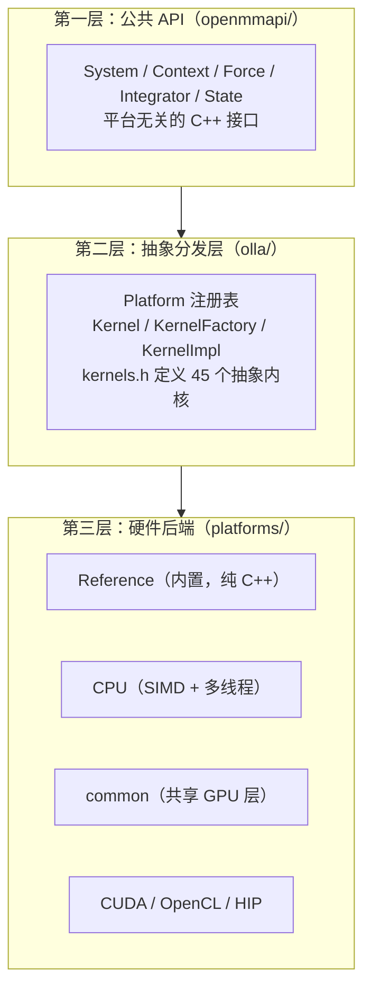

# 01 · OpenMM 整体架构概览

## 1.1 OpenMM 是什么

OpenMM 是斯坦福大学开发的高性能分子动力学（Molecular Dynamics, MD）模拟工具库，采用 MIT/LGPL 双许可。它的独特之处在于三者的结合：

- **极致灵活性**：通过自定义力（Custom Force）和自定义积分器（CustomIntegrator），用户可用数学表达式字符串定义任意势能与积分算法
- **高性能**：针对现代 GPU（NVIDIA CUDA / AMD HIP / OpenCL）深度优化
- **开放可扩展**：通过插件式 Platform/Kernel 架构，可新增硬件后端而无需改动核心 API

源码 README（`README.md:9-11`）原话：
> a toolkit for molecular simulation ... a combination of extreme flexibility (through custom forces and integrators), openness, and high performance (especially on recent GPUs).

版本信息：**OpenMM 8.5.0**（`CMakeLists.txt:158-160`），C++11 标准。

## 1.2 三层架构

OpenMM 在源码层面分为三个清晰的层次：



### 第一层：公共 API（`openmmapi/`）

平台无关的用户接口。用户构造 `System`（分子模型）、`Force`（力场项）、`Integrator`（积分器），再创建 `Context`（运行时状态）来跑模拟。这一层**完全不感知硬件**——它只声明"我需要哪些内核（kernel）"，由下层负责实际计算。

关键类：`System`、`Context`、`Force`（30+ 子类）、`Integrator`（12+ 子类）、`State`、`Vec3`、`LocalEnergyMinimizer`。

详细见 [02-core-api.md](02-core-api.md)。

### 第二层：抽象分发层（`olla/`）

**olla = OpenMM Low-Level Abstraction**，是整个多后端架构的基石。它定义：

- `Platform`：抽象平台基类 + 全局平台注册表 + 动态插件加载器
- `Kernel` / `KernelImpl`：内核句柄与抽象接口
- `KernelFactory`：抽象工厂，把"内核名字字符串"转成具体 `KernelImpl*`
- `kernels.h`：45 个抽象内核接口（每种力/积分器各一个），是**每个平台必须实现的契约**
- `PluginInitializer.h`：插件库导出的 C 符号 `registerPlatforms()` / `registerKernelFactories()`

这一层实现了 **Strategy + AbstractFactory + Registry** 模式，使算法与硬件后端彻底解耦。

详细见 [03-platform-kernel.md](03-platform-kernel.md)。

### 第三层：硬件后端（`platforms/`）

6 个具体平台实现：

| 平台 | 目录 | `getName()` | `getSpeed()` | 特点 |
|------|------|------------|-------------|------|
| Reference | `platforms/reference/` | `"Reference"` | 1 | 纯 C++ 可移植参考实现，全双精度，**唯一内置进核心库的平台** |
| CPU | `platforms/cpu/` | `"CPU"` | 10 | SIMD 向量化（SSE/AVX/AVX2/NEON）+ 多线程，继承自 Reference |
| common | `platforms/common/` | — | — | **非独立平台**，CUDA/OpenCL/HIP 共享的 GPU 计算抽象层 |
| CUDA | `platforms/cuda/` | `"CUDA"` | 高 | NVIDIA GPU，`.cu` 内核 |
| OpenCL | `platforms/opencl/` | `"OpenCL"` | 高 | 跨厂商 GPU，`.cl` 内核 |
| HIP | `platforms/hip/` | `"HIP"` | 高 | AMD GPU，`.hip` 内核 |

**对 NPU 适配者最重要的发现**：CUDA/OpenCL/HIP 三个 GPU 平台**共享** `common/` 层的 90% 代码——它们各自的 `*KernelFactory` 几乎只返回 `CommonXxxKernel` 对象（用各自的 `*Context` 实例化）。NPU 后端最自然的实现方式就是模仿这一范式，新增一个 `NpuPlatform` + `NpuContext`，复用 `common/` 的 `CommonXxxKernel`。

详细见 [04-platforms.md](04-platforms.md)。

## 1.3 核心设计理念

### 1.3.1 平台无关 API + 平台相关内核

OpenMM 的核心哲学是：**用户写一份代码，自动跑在最快可用的硬件上**。

用户代码：
```cpp
System system;
system.addForce(new NonbondedForce());
LangevinIntegrator integ(300, 1.0, 0.002);
Context context(system, integ);   // 自动选最快平台
integ.step(10000);
```

`Context` 构造时，`ContextImpl` 收集所有 `Force` 和 `Integrator` 声明的内核名，调用 `Platform::findPlatform()` 选出支持这些内核且 `getSpeed()` 最大的平台。用户无需指定 CUDA/CPU/HIP。

### 1.3.2 Kernel-by-Name 分发

整个分发机制基于**字符串内核名**。例如 `NonbondedForce` 声明需要 `"CalcNonbondedForceKernel"`，`LangevinIntegrator` 声明需要 `"IntegrateLangevinMiddleStepKernel"`。每个 `Platform` 在构造时用 `registerKernelFactory(name, factory)` 注册自己的工厂。`Context` 创建内核时：

```
platform.createKernel("CalcNonbondedForceKernel", context)
  → KernelFactory::createKernelImpl("CalcNonbondedForceKernel", ...)
    → 返回 CudaCalcNonbondedForceKernel / CpuCalcNonbondedForceKernel / ...
```

调用方通过 `Kernel::getAs<CalcNonbondedForceKernel>()` 取得类型化接口（`kernels.h` 中声明的抽象类）来执行。

### 1.3.3 两阶段插件自注册

每个平台/插件共享库导出两个 C 符号：
```cpp
extern "C" void registerPlatforms();        // 创建并注册 Platform 对象
extern "C" void registerKernelFactories();  // 向已注册的 Platform 追加 Kernel 工厂
```

`Platform::loadPluginsFromDirectory()` 加载目录下所有 `.so`/`.dll` 时，**先调用所有库的 `registerPlatforms()`，再调用所有库的 `registerKernelFactories()`**。这种两阶段顺序避免了"插件 A 想给插件 B 定义的平台追加内核"时的初始化顺序问题。

源码：`olla/src/Platform.cpp` 的 `initializePlugins()`。

### 1.3.4 Force ↔ ForceImpl 桥接（Bridge 模式）

公共 API 中的每个 `Force` 子类是**不可变的描述对象**（参数表）。`Context` 创建时为每个 `Force` 调用 `Force::createImpl()` 生成一个 `ForceImpl`（`openmmapi/include/openmm/internal/ForceImpl.h`）——后者是**可变的、绑定到具体 Context 的实现**，负责预计算、缓存、调用内核、暴露参数。

```
NonbondedForce（公共描述）  ←→  NonbondedForceImpl（Context 内实现）
HarmonicBondForce           ←→  HarmonicBondForceImpl
CustomNonbondedForce        ←→  CustomNonbondedForceImpl
```

恒温器/恒压器也建模为 `Force` 子类（`AndersenThermostat`、`MonteCarloBarostat`、`CMMotionRemover`），它们的 `ForceImpl::updateContextState()` 在每步积分前被调用以修改状态。

### 1.3.5 表达式 JIT 求值

所有 `Custom*Force` 和 `CustomIntegrator` 接受用户输入的数学表达式字符串（如 `"0.5*k*(r-r0)^2"`）。这些字符串由 **Lepton** 库（`libraries/lepton/`）解析、优化，再经 **asmjit**（`libraries/asmjit/`）在 CPU 上 JIT 编译为本地机器码；在 GPU 上则被转译为目标平台内核源码（CUDA/OpenCL/HIP）并在线编译。这使得自定义力的开销接近手写代码。

## 1.4 仓库目录结构总览

```
openmm/   # 仓库根 https://github.com/openmm/openmm
├── CMakeLists.txt              # 顶层构建，版本 8.5.0，C++11
├── README.md
├── openmmapi/                  # 【第一层】平台无关公共 C++ API
│   ├── include/openmm/         #   公共头（System.h, Context.h, Force.h, ...）
│   └── src/                    #   实现（含 ContextImpl.cpp 引擎、各 ForceImpl.cpp）
├── olla/                       # 【第二层】OpenMM Low-Level Abstraction
│   ├── include/openmm/         #   Platform.h, Kernel.h, KernelFactory.h, kernels.h, PluginInitializer.h
│   └── src/                    #   Platform.cpp（注册表+插件加载）, Kernel.cpp
├── platforms/                  # 【第三层】硬件后端
│   ├── reference/              #   纯 C++ 参考平台（内置进核心库）
│   ├── cpu/                    #   SIMD+多线程 CPU 平台（继承 Reference）
│   ├── common/                 #   共享 GPU 计算层（非独立平台）
│   ├── cuda/                   #   NVIDIA CUDA 平台
│   ├── opencl/                 #   OpenCL 平台
│   └── hip/                    #   AMD HIP 平台
├── plugins/                    # 功能扩展插件
│   ├── amoeba/                 #   AMOEBA/HIPPO 极化力场
│   ├── drude/                  #   Drude 振子
│   ├── rpmd/                   #   环聚合物 MD
│   └── cpupme/                 #   CPU 加速 PME
├── serialization/              # XML 序列化（SerializationProxy 机制）
├── wrappers/                   # 语言封装生成
│   ├── generateWrappers.py     #   C/Fortran 封装生成器（非 SWIG）
│   └── python/                 #   Python 封装（SWIG + Doxygen XML 生成）
├── libraries/                  # 11 个第三方库（lepton/vecmath/asmjit/vkfft/...）
├── examples/                   # 示例（C++/C/Fortran/Python）
├── tests/                      # C++ 测试（CTest + 自定义 ASSERT 宏）
├── docs-source/                # 文档源（Sphinx 用户/开发指南 + Doxygen API）
├── cmake_modules/              # 自定义 CMake 模块（FindOpenCL/TargetArch/EncodeKernelFiles）
└── devtools/                   # 开发辅助脚本
```

## 1.5 关键设计模式汇总

| 模式 | 应用位置 | 说明 |
|------|---------|------|
| **PIMPL / Handle-Body** | `Context`→`ContextImpl`、`State`→`StateBuilder` | 公共类是值语义句柄，实现在 internal 头里 |
| **Bridge（信封-信）** | `Force`↔`ForceImpl`、`Integrator`↔内核 | 描述对象与上下文绑定实现分离 |
| **Strategy + AbstractFactory** | `Platform`/`Kernel`/`KernelFactory` | 按内核名创建平台相关实现 |
| **Registry** | `Platform::registerPlatform`、`SerializationProxy::registerProxy` | 全局注册表，启动时自注册 |
| **Interpreter + JIT** | Lepton + asmjit / GPU 在线编译 | 用户表达式即时编译 |
| **Plugin（动态加载）** | `loadPluginsFromDirectory` + `registerPlatforms/registerKernelFactories` | 运行时 `.so`/`.dll` 加载 |
| **Template Method** | `ContextImpl::calcForcesAndEnergy` 调用各 `ForceImpl` | 固定流程，子类填实现 |

## 1.6 下一步阅读

- 想理解 API 表面 → [02-core-api.md](02-core-api.md)
- 想理解后端如何接入 → [03-platform-kernel.md](03-platform-kernel.md)（NPU 适配必读）
- 想看具体后端怎么写 → [04-platforms.md](04-platforms.md)
- 想直接动手适配 NPU → [11-npu-adaptation-guide.md](11-npu-adaptation-guide.md)
