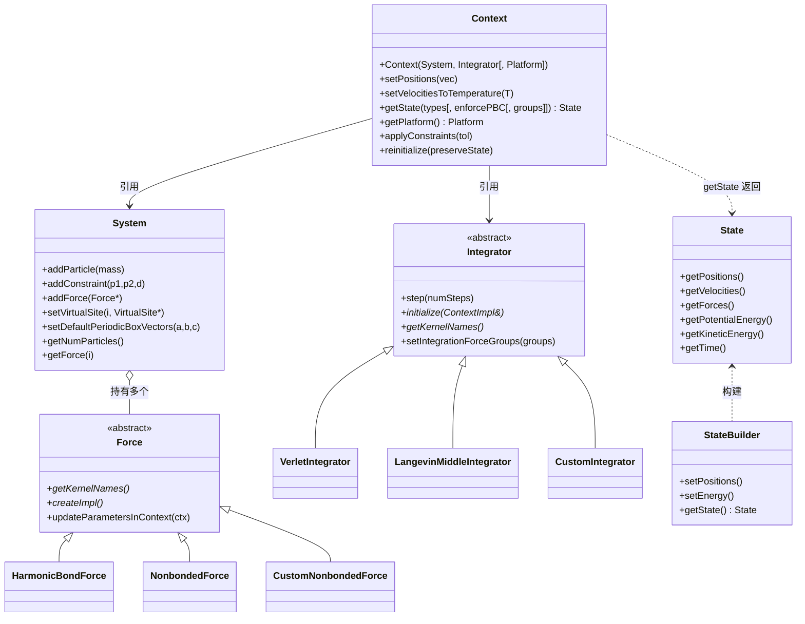

# 02 · 公共 C++ API 详解（openmmapi/）

本篇梳理 OpenMM 平台无关的公共 C++ API，位于 `https://github.com/openmm/openmm/blob/master/openmmapi/`。这是用户与 OpenMM 交互的入口，也是所有硬件后端必须服务的"契约"。

## 2.1 目录结构

```
openmmapi/
├── include/openmm/           # 公共头（用户 #include 这些）
│   ├── System.h, Context.h, State.h, Force.h, Integrator.h, Vec3.h, Units.h
│   ├── HarmonicBondForce.h, NonbondedForce.h, CustomNonbondedForce.h, ...（30+ Force）
│   ├── VerletIntegrator.h, LangevinMiddleIntegrator.h, CustomIntegrator.h, ...（12+ Integrator）
│   ├── AndersenThermostat.h, MonteCarloBarostat.h, CMMotionRemover.h, ...
│   ├── LocalEnergyMinimizer.h, TabulatedFunction.h, VirtualSite.h, OpenMMException.h
│   └── internal/             # 内部架构头（ForceImpl.h, ContextImpl.h, vectorize*.h, ThreadPool.h）
└── src/                      # 实现（~110 个 .cpp）
    ├── Context.cpp, System.cpp, State.cpp, Integrator.cpp, Force.cpp
    ├── ContextImpl.cpp       # 真正的模拟引擎（PIMPL）
    ├── *Force.cpp + *Impl.cpp（每个 Force 配一个 ForceImpl 实现）
    ├── *Integrator.cpp
    ├── LocalEnergyMinimizer.cpp, SplineFitter.cpp, ThreadPool.cpp, ...
```

## 2.2 核心类关系图



## 2.3 System —— 分子模型容器

**头文件**：`openmmapi/include/openmm/System.h`

`System` 是分子模型的不可变描述，包含：
- 粒子（particle）：质量、位置由 Context 管理
- 约束（constraint）：固定两粒子距离
- 虚拟位点（virtual site）：由其它粒子位置计算得到
- 力（Force）：任意多个 `Force` 子类
- 周期性盒子（periodic box）：三边向量

`System` **不做任何计算**，只是数据容器。`Context` 创建时读取它。

关键方法：`addParticle(mass)`、`addConstraint(p1,p2,distance)`、`addForce(Force*)`（接管所有权）、`setVirtualSite(index, VirtualSite*)`、`setDefaultPeriodicBoxVectors(a,b,c)`。

虚拟位点类型（`openmmapi/include/openmm/VirtualSite.h`）：
- `TwoParticleAverageSite`：两粒子加权平均
- `ThreeParticleAverageSite`：三粒子加权平均
- `OutOfPlaneSite`：出面位点
- `LocalCoordinateSite`：局部坐标系定义

## 2.4 Force 家族 —— 力场项

**基类**：`openmmapi/include/openmm/Force.h`（抽象）

所有力都是 `Force` 子类，分几大类：

### 2.4.1 标准力（内置、所有平台必支持）

| 类 | 文件 | 物理意义 |
|----|------|---------|
| `HarmonicBondForce` | `HarmonicBondForce.h` | 谐波键伸缩 |
| `HarmonicAngleForce` | `HarmonicAngleForce.h` | 谐波角度弯曲 |
| `PeriodicTorsionForce` | `PeriodicTorsionForce.h` | 周期（Fourier）二面角 |
| `RBTorsionForce` | `RBTorsionForce.h` | Ryckaert-Bellemans 二面角 |
| `CMAPTorsionForce` | `CMAPTorsionForce.h` | 校正图二面角（2D 网格） |
| `NonbondedForce` | `NonbondedForce.h` | **核心**：Coulomb + Lennard-Jones 非键，支持 cutoff/PME/exceptions/参数偏移 |
| `GBSAOBCForce` | `GBSAOBCForce.h` | GBSA-OBC 隐式溶剂 |
| `GayBerneForce` | `GayBerneForce.h` | Gay-Berne 各向异性 LJ |
| `LCPOForce` | `LCPOForce.h` | LCPO 溶剂可及面积 |

### 2.4.2 自定义力（用户表达式驱动）

| 类 | 用途 |
|----|------|
| `CustomBondForce` | 自定义两粒子键合 |
| `CustomAngleForce` | 自定义三粒子角 |
| `CustomTorsionForce` | 自定义四粒子二面角 |
| `CustomExternalForce` | 自定义单粒子外力 |
| `CustomNonbondedForce` | 自定义成对非键 |
| `CustomManyParticleForce` | 自定义 N 粒子（N≥2） |
| `CustomCompoundBondForce` | 自定义任意粒子集"键" |
| `CustomCentroidBondForce` | 粒子组质心间键 |
| `CustomGBForce` | 多阶段广义 Born |
| `CustomHbondForce` | 氢键 |
| `CustomCVForce` | 集合变量（CV）能量，每个 CV 本身是 Force |
| `CustomVolumeForce` | 依赖盒子体积的能量 |

自定义力的表达式由 **Lepton** 解析，CPU 端 asmjit JIT，GPU 端转译为内核源码。

### 2.4.3 特殊力

| 类 | 用途 |
|----|------|
| `RMSDForce` | 能量 = 到参考结构的 RMSD |
| `RGForce` | 能量 = 回旋半径 |
| `OrientationRestraintForce` | 取向约束 |
| `ConstantPotentialForce` | 恒电势（电化学） |
| `ATMForce` | Alchemical Transfer Method 自由能 |
| `PythonForce` | Python 回调计算力（通过 directors） |

### 2.4.4 恒温器/恒压器（建模为 Force）

OpenMM 把恒温器、恒压器、质心运动消除器都做成 `Force` 子类，它们的 `ForceImpl::updateContextState()` 在每步积分前被调用以修改速度/盒子：

- `AndersenThermostat`（`AndersenThermostat.h`）
- `MonteCarloBarostat` / `MonteCarloAnisotropicBarostat` / `MonteCarloFlexibleBarostat` / `MonteCarloMembraneBarostat`
- `CMMotionRemover`

### 2.4.5 TabulatedFunction —— 制表函数

`openmmapi/include/openmm/TabulatedFunction.h`：自定义力可引用的样条插值/离散查找表，类型有 `Continuous1D/2D/3D`、`Discrete1D/2D/3D`。由 `SplineFitter`（`openmmapi/src/SplineFitter.cpp`）提供自然三次样条插值。

## 2.5 Integrator 家族 —— 积分器

**基类**：`openmmapi/include/openmm/Integrator.h`（抽象）

`step(int numSteps)` 是唯一用户入口。每个积分器声明自己需要的内核名（`getKernelNames()`）。

| 类 | 文件 | 算法 |
|----|------|------|
| `VerletIntegrator` | `VerletIntegrator.h` | 蛙跳 Verlet（NVE） |
| `LangevinMiddleIntegrator` | `LangevinMiddleIntegrator.h` | Langevin BAOAB（推荐） |
| `LangevinIntegrator` | `LangevinIntegrator.h` | 同上（向后兼容别名） |
| `BrownianIntegrator` | `BrownianIntegrator.h` | 过阻尼 Brownian |
| `VariableVerletIntegrator` | `VariableVerletIntegrator.h` | 自适应步长 Verlet |
| `VariableLangevinIntegrator` | `VariableLangevinIntegrator.h` | 自适应步长 Langevin |
| `NoseHooverIntegrator` | `NoseHooverIntegrator.h` + `NoseHooverChain.h` | Nose-Hoover 链（NVT/NPT） |
| `DPDIntegrator` | `DPDIntegrator.h` | 耗散粒子动力学 |
| `QTBIntegrator` | `QTBIntegrator.h` | 量子热浴 |
| `CustomIntegrator` | `CustomIntegrator.h` | **用户可脚本化**：全局/每 DOF 变量 + 计算步骤 |
| `CompoundIntegrator` | `CompoundIntegrator.h` | 在多个积分器间切换 |

`CustomIntegrator` 是 OpenMM 灵活性的核心——用户用一组 `beginIfBlock`/`compute`/`endBlock` 指令编写积分算法，表达式经 Lepton 编译。多时间步（MTS）通过 `setIntegrationForceGroups()` 选择性评估力组实现。

## 2.6 Context —— 运行时状态

**头文件**：`openmmapi/include/openmm/Context.h`
**实现**：`openmmapi/src/Context.cpp`（薄壳）+ `openmmapi/src/ContextImpl.cpp`（引擎，PIMPL）

`Context` 是活生生的模拟状态——位置、速度、时间、参数——并桥接 `System`+`Integrator`+`Platform`。

### 构造

```cpp
Context(system, integrator [, platform [, properties]])
```
- 不传 `Platform`：自动选最快可用平台（`Platform::findPlatform`）
- 传 `Platform`：强制指定，但必须 `supportsKernels`
- `properties`：平台特定属性（如 `{"Precision":"mixed","DeviceIndex":"0"}`）

构造链（`ContextImpl.cpp`）：
1. 收集所有 `ForceImpl::getKernelNames()` + `Integrator::getKernelNames()`
2. `Platform::findPlatform(kernelNames)` 或用传入的
3. `platform.contextCreated(this, properties)` 让平台挂平台数据
4. 为每个 `Force` 调用 `Force::createImpl()` → 存入 `forceImpls`
5. `Integrator::initialize(contextImpl)` 创建积分内核
6. 缓存若干共用内核：`initializeForcesKernel`、`updateStateDataKernel`、`applyConstraintsKernel`、`virtualSitesKernel`、`minimizeKernel`

### 关键方法

| 方法 | 作用 |
|------|------|
| `setPositions(vec)` | 设置粒子位置 |
| `setVelocities(vec)` / `setVelocitiesToTemperature(T, seed)` | 设置速度 |
| `setPeriodicBoxVectors(a,b,c)` | 设置周期盒 |
| `setParameter(name, value)` | 设置全局参数 |
| `getTime()` / `getStepCount()` | 查询时间/步数 |
| `getState(types[, enforcePBC[, groups]])` | 取状态快照 |
| `getPlatform()` | 返回所用平台 |
| `applyConstraints(tol)` | 施加约束 |
| `reinitialize(preserveState)` | 重建 ContextImpl（参数改后） |
| `createCheckpoint(ostream)` / `loadCheckpoint(istream)` | 二进制检查点 |
| `getState` 的 `types` | `State::Positions/Velocities/Forces/Energy/Parameters` 位掩码 |

## 2.7 State —— 不可变快照

**头文件**：`openmmapi/include/openmm/State.h`

`State` 是某时刻模拟状态的不可变快照，只能由 `Context::getState()` 或 `State::StateBuilder`（友元）创建。包含：位置、速度、力、势能、动能、时间、步数、周期盒、参数。

## 2.8 ContextImpl —— 真正的引擎

**头文件**：`openmmapi/include/openmm/internal/ContextImpl.h`
**实现**：`openmmapi/src/ContextImpl.cpp`

这是 PIMPL 后的 `Context` 实现，持有：
- `System&`、`Integrator&`、`Platform*`
- `vector<ForceImpl*> forceImpls`
- 缓存的共用 `Kernel`（initializeForces / updateStateData / applyConstraints / virtualSites / minimize）
- `void* platformData`（平台私有数据，如 `CudaContext*`）
- 分子列表、能量参数导数

核心方法：
- `calcForcesAndEnergy(includeForces, includeEnergy, groups)`：调用 `CalcForcesAndEnergyKernel::beginComputation` → 各 `ForceImpl::calcForcesAndEnergy` → `endComputation`。支持力组过滤。
- `updateContextState()`：每步前调用各 `ForceImpl::updateContextState`（恒温器/恒压器）
- `applyConstraints(tol)`：调用 `ApplyConstraintsKernel`
- `computeVirtualSites()`：调用 `VirtualSitesKernel`
- `calcKineticEnergy()`：委托 `Integrator::computeKineticEnergy()`
- `minimize(...)`：调用 `MinimizeKernel`（L-BFGS）

## 2.9 ForceImpl —— Force 的上下文绑定实现

**头文件**：`openmmapi/include/openmm/internal/ForceImpl.h`

桥接接口，每个 `Force` 子类配一个 `ForceImpl` 子类。契约：
```cpp
class ForceImpl {
    virtual void initialize(ContextImpl&) = 0;
    virtual const Force& getOwner() const = 0;
    virtual void updateContextState(ContextImpl&, bool& forcesInvalid) {}
    virtual double calcForcesAndEnergy(ContextImpl&, bool includeForces,
                                       bool includeEnergy, bool includeDirect, bool includeReciprocal,
                                       int groups) = 0;
    virtual map<string,double> getDefaultParameters() { return {}; }
    virtual vector<string> getKernelNames() = 0;
    virtual void getBondedParticles(vector<pair<int,int>>&) const {}
};
```

`CustomCPPForceImpl`（`internal/CustomCPPForceImpl.h`）是便捷基类：实现一次纯 C++ `computeForce()`，由内部 `CalcCustomCPPForceKernel` 在所有平台运行。`PythonForce`、`ATMForce` 等用它。**NPU 适配提示**：若想快速接入一个新力，可继承 `CustomCPPForceImpl`，但会失去 GPU/NPU 加速——高性能实现应走自定义内核。

## 2.10 LocalEnergyMinimizer —— 能量最小化

**头文件**：`openmmapi/include/openmm/LocalEnergyMinimizer.h`

通过 `ContextImpl::minimize` → `MinimizeKernel` 驱动 L-BFGS（`libraries/lbfgs/`）。约束作为软约束加入目标函数。`MinimizationReporter`（director）可被 Python 子类化以观察进度。

## 2.11 端到端使用范式

```cpp
// 1. 构建 System
System system;
for (each atom) system.addParticle(mass);
NonbondedForce* nb = new NonbondedForce();
for (each atom) nb->addParticle(charge, sigma, epsilon);
system.addForce(nb);
system.addForce(new MonteCarloBarostat(1.0, 300));   // 恒压器是 Force
system.setDefaultPeriodicBoxVectors(...);

// 2. 选积分器
LangevinMiddleIntegrator integ(300, 1.0, 0.002);  // T, friction, dt

// 3. 创建 Context（自动选平台）
Context context(system, integ);
context.setPositions(initialPositions);
context.setVelocitiesToTemperature(300);

// 4. 最小化
LocalEnergyMinimizer::minimize(context, 1.0);

// 5. 模拟循环
for (int i = 0; i < nsteps; i += 100) {
    integ.step(100);
    State state = context.getState(State::Positions | State::Energy, true);
    // 写轨迹/日志
}
```

## 2.12 internal/ 关键头一览

| 头文件 | 揭示 |
|--------|------|
| `internal/ContextImpl.h` | 真正的 Context 引擎，缓存内核 |
| `internal/ForceImpl.h` | Force↔ForceImpl 桥接契约 |
| `internal/*ForceImpl.h` | 每个 Force 的具体 Impl |
| `internal/CustomCPPForceImpl.h` | 便携 C++ 力基类 |
| `internal/ThreadPool.h` | CPU 工作线程池 |
| `internal/vectorize*.h` | SIMD 包装（sse/avx/avx2/neon/ppc/portable） |
| `internal/hardware.h` | CPU 特性检测 + 便携定时器 |
| `internal/CompiledExpressionSet.h`、`VectorExpression.h` | Lepton 表达式编译/求值 |
| `internal/SplineFitter.h` | 制表函数样条拟合 |
| `internal/AssertionUtilities.h` | 测试断言宏 |

## 2.13 小结

公共 API 层的关键认识（对 NPU 适配者）：

1. **API 不感知硬件**：`System`/`Force`/`Integrator` 只声明"我需要哪些内核名"
2. **Context 是枢纽**：它收集内核需求、选平台、创建 `ForceImpl`、缓存共用内核
3. **ForceImpl 是力的运行时形态**：NPU 后端要为每个 Force 提供 `CalcXxxForceKernel`
4. **kernels.h 是契约**：45 个抽象内核接口定义了 NPU 平台必须实现的全部计算
5. **Custom 力的内核是通用的**：`CustomNonbondedForce` 等只需一个 `CalcCustomNonbondedForceKernel`，由平台处理表达式编译——NPU 后端复用 `common/` 的实现即可

下一篇 [03-platform-kernel.md](03-platform-kernel.md) 详解这个分发机制。
