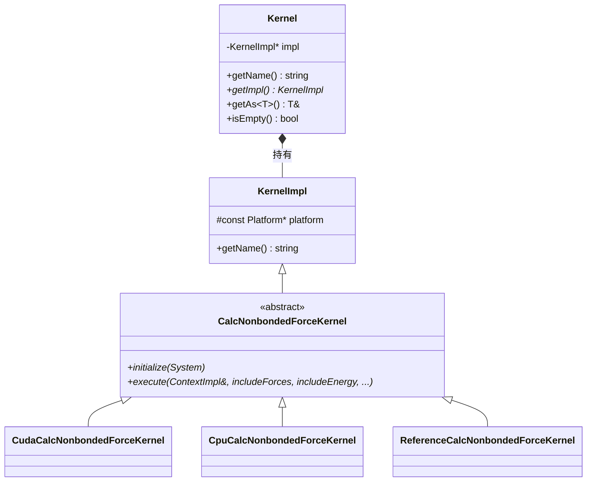
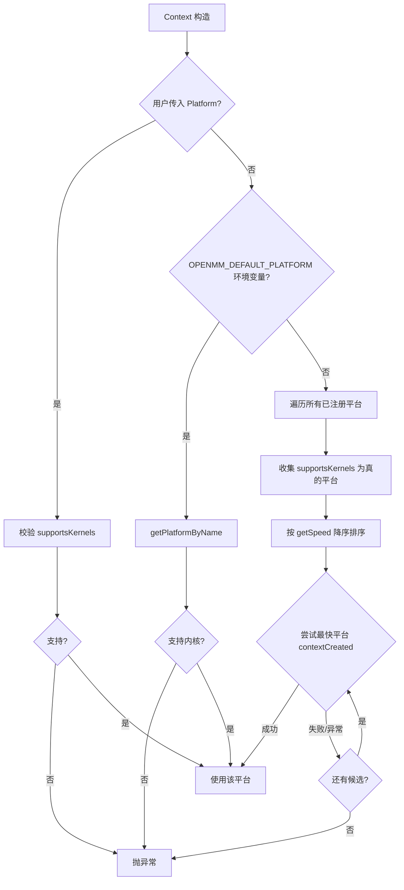
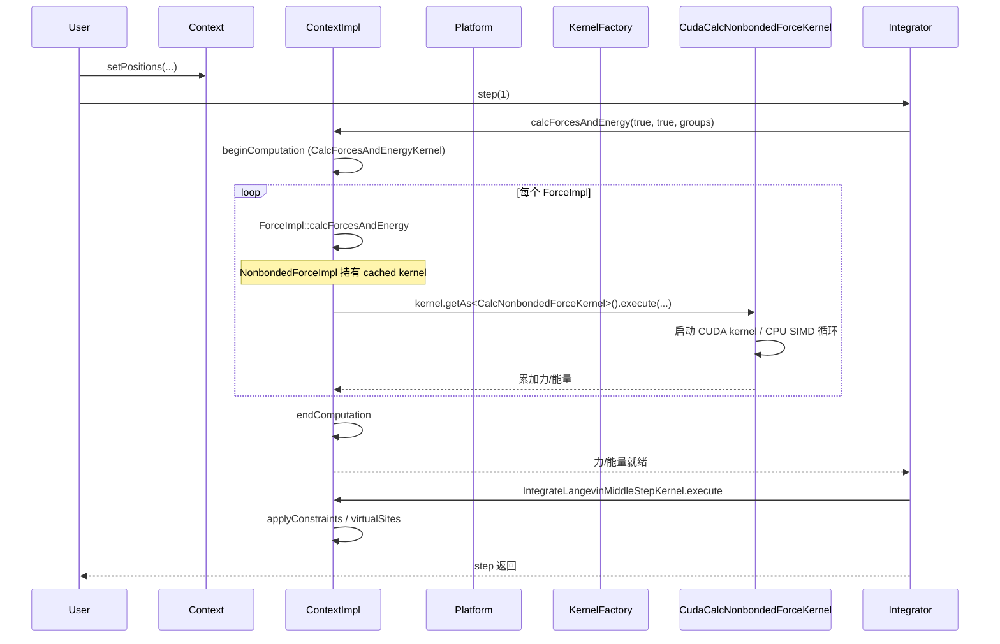

# 03 · Platform / Kernel 抽象与插件机制（olla/）

**这是 NPU 适配者最关键的一篇。** OpenMM 整个多后端架构的核心就在 `https://github.com/openmm/openmm/blob/master/olla/`（OpenMM Low-Level Abstraction）。理解它，就知道新增一个 NPU 平台需要做什么。

## 3.1 olla 在源码中的位置

```
olla/   # https://github.com/openmm/openmm/tree/master/olla
├── include/openmm/
│   ├── Platform.h           # 抽象平台基类 + 注册表 + 插件加载器
│   ├── Kernel.h             # 内核句柄（值类型，包 KernelImpl*）
│   ├── KernelImpl.h         # 内核实现基类
│   ├── KernelFactory.h      # 抽象工厂
│   ├── kernels.h            # 【契约】45 个抽象内核接口
│   └── PluginInitializer.h  # 插件库导出的 C 符号
└── src/
    ├── Platform.cpp         # 注册表实现 + dlopen 加载 + findPlatform
    ├── Kernel.cpp
    └── KernelImpl.cpp
```

> 注意：在旧版 OpenMM 中这些头在 `openmmapi/include/openmm/`，8.x 重构后移到独立的 `olla/` 目录，但仍以 `#include "openmm/Platform.h"` 形式引用。

## 3.2 核心抽象类

### 3.2.1 Platform（抽象平台）

**头**：`olla/include/openmm/Platform.h`

每个硬件后端是一个 `Platform` 子类。关键 API：

```cpp
class Platform {
public:
    virtual const string& getName() const = 0;          // "Reference"/"CPU"/"CUDA"/"OpenCL"/"HIP"
    virtual double getSpeed() const = 0;                // 相对速度（选平台用）
    virtual bool supportsDoublePrecision() const = 0;

    // 内核工厂注册
    void registerKernelFactory(const string& name, KernelFactory* factory);
    bool supportsKernels(const vector<string>& names) const;
    Kernel createKernel(const string& name, ContextImpl& context) const;

    // Context 生命周期钩子
    virtual void contextCreated(ContextImpl&, const map<string,string>& properties) {}
    virtual void contextDestroyed(ContextImpl&) {}
    virtual void linkedContextCreated(ContextImpl&, ContextImpl&) {}

    // 属性
    virtual vector<string> getPropertyNames() const;
    virtual string getPropertyValue(ContextImpl&, const string&) const;
    virtual void setPropertyDefaultValue(const string&, const string&);

    // === 静态注册表 ===
    static void registerPlatform(Platform*);
    static int getNumPlatforms();
    static Platform& getPlatform(int);
    static Platform& getPlatformByName(const string&);
    static Platform& findPlatform(const vector<string>& kernelNames);

    // === 插件加载 ===
    static void loadPluginLibrary(const string& file);
    static vector<string> loadPluginsFromDirectory(const string& dir);
    static const string& getDefaultPluginsDirectory();
    static vector<string> getPluginLoadFailures();
    static const string& getOpenMMVersion();

protected:
    map<string, KernelFactory*> kernelFactories;   // 内核名 → 工厂
};
```

### 3.2.2 Kernel / KernelImpl

**头**：`olla/include/openmm/Kernel.h`、`KernelImpl.h`



- `Kernel` 是**值语义句柄**，持有 `KernelImpl*`，可拷贝
- `Kernel::getAs<T>()` 做 `dynamic_cast<T&>(*impl)`，得到 `kernels.h` 中声明的类型化接口
- `KernelImpl` 是基类，携带 `name` 和 `platform` 反指针

### 3.2.3 KernelFactory（抽象工厂）

**头**：`olla/include/openmm/KernelFactory.h`

```cpp
class KernelFactory {
public:
    virtual KernelImpl* createKernelImpl(string name, const Platform& platform, ContextImpl& context) const = 0;
};
```

每个 `Platform` 拥有一个（或几个）`KernelFactory` 实例。`createKernel` 时按 `name` switch 返回对应 `KernelImpl` 子类。典型实现（`platforms/cpu/src/CpuKernelFactory.cpp`）是一个长 `if/else` 链。

### 3.2.4 kernels.h —— 45 个抽象内核接口（契约）

**头**：`olla/include/openmm/kernels.h`

这是**每个平台必须实现的全部计算的清单**。每个内核是 `KernelImpl` 的抽象子类，声明纯虚 `execute(...)`，并提供 `static string Name()` 作为注册键。

按类别列举（部分）：

| 类别 | 内核接口示例 |
|------|-------------|
| 通用 | `CalcForcesAndEnergyKernel`、`UpdateStateDataKernel`、`ApplyConstraintsKernel`、`VirtualSitesKernel`、`MinimizeKernel` |
| 键合 | `CalcHarmonicBondForceKernel`、`CalcHarmonicAngleForceKernel`、`CalcPeriodicTorsionForceKernel`、`CalcRBTorsionForceKernel`、`CalcCMAPTorsionForceKernel` |
| 非键 | `CalcNonbondedForceKernel`、`CalcCustomNonbondedForceKernel`、`CalcDispersionPmeReciprocalForceKernel` |
| 自定义 | `CalcCustomBondForceKernel`、`CalcCustomAngleForceKernel`、`CalcCustomTorsionForceKernel`、`CalcCustomExternalForceKernel`、`CalcCustomManyParticleForceKernel`、`CalcCustomCompoundBondForceKernel`、`CalcCustomCentroidBondForceKernel`、`CalcCustomGBForceKernel`、`CalcCustomHbondForceKernel`、`CalcCustomCVForceKernel`、`CalcCustomVolumeForceKernel` |
| 隐式溶剂 | `CalcGBSAOBCForceKernel`、`CalcGayBerneForceKernel`、`CalcLCPOForceKernel` |
| 特殊 | `CalcRMSDForceKernel`、`CalcRGForceKernel`、`CalcOrientationRestraintForceKernel`、`CalcConstantPotentialForceKernel`、`CalcATMForceKernel`、`CalcCustomCPPForceKernel`、`CalcPythonForceKernel` |
| 积分 | `IntegrateVerletStepKernel`、`IntegrateLangevinMiddleStepKernel`、`IntegrateBrownianStepKernel`、`IntegrateVariableVerletStepKernel`、`IntegrateVariableLangevinStepKernel`、`IntegrateCustomStepKernel`、`IntegrateNoseHooverStepKernel`、`IntegrateDPDStepKernel`、`IntegrateQTBStepKernel`、`IntegrateCompoundStepKernel` |
| 恒温恒压 | `ApplyAndersenThermostatKernel`、`ApplyMonteCarloBarostatKernel`、`RemoveCMMotionKernel` |

**NPU 适配要点**：不必全部手写。若复用 `platforms/common/` 的 `CommonXxxKernel`，约 40 个内核直接可用，只需手写 5 个左右平台特定内核（见 04/11 篇）。

## 3.3 平台选择算法

`Context` 构造时的选择流程（`openmmapi/src/ContextImpl.cpp` 构造函数 + `olla/src/Platform.cpp::findPlatform`）：



`getSpeed()` 参考值：Reference=1、CPU=10、GPU 平台返回大数值（CUDA/HIP 通常最高）。因此**只要 GPU 平台成功加载插件，自动优先选中**。

## 3.4 插件自注册机制

### 3.4.1 两个 C 符号

**头**：`olla/include/openmm/PluginInitializer.h`

每个平台/插件共享库导出：
```cpp
extern "C" OPENMM_EXPORT void registerPlatforms();        // 创建 Platform 对象并注册
extern "C" void registerKernelFactories();                // 向已注册 Platform 追加 KernelFactory
```

### 3.4.2 两阶段加载顺序

`Platform::loadPluginsFromDirectory(dir)`（`olla/src/Platform.cpp`）对目录下每个文件：
1. `dlopen`（POSIX）/ `LoadLibrary`（Win32）
2. `dlsym` 取 `registerPlatforms` 和 `registerKernelFactories` 符号

**关键**：加载完所有库后，**先调用所有库的 `registerPlatforms()`，再调用所有库的 `registerKernelFactories()`**。这避免"插件 A 想给插件 B 定义的平台追加内核"时的顺序问题——所有 Platform 先就位，再统一注册 Kernel 工厂。

### 3.4.3 平台示例：CPU 平台的自注册

`platforms/cpu/src/CpuPlatform.cpp:46-57`：
```cpp
extern "C" OPENMM_EXPORT_CPU void registerPlatforms() {
    if (CpuPlatform::isProcessorSupported())    // 要求 SSE4.1
        Platform::registerPlatform(new CpuPlatform());
}
```

`CpuPlatform` 构造函数里向自己注册若干 `CpuKernelFactory`（仅它向量化的内核），其余内核靠继承自 `ReferencePlatform` 的工厂兜底。

### 3.4.4 插件示例：amoeba 向 CUDA 平台追加内核

`platforms/cuda/src/AmoebaCudaKernelFactory.cpp` 的 `registerKernelFactories()`：
```cpp
extern "C" void registerKernelFactories() {
    try {
        Platform& platform = Platform::getPlatformByName("CUDA");   // 找已注册的 CUDA 平台
        AmoebaCudaKernelFactory* factory = new AmoebaCudaKernelFactory();
        platform.registerKernelFactory(CalcAmoebaMultipoleForceKernel::Name(), factory);
        platform.registerKernelFactory(CalcAmoebaVdwForceKernel::Name(), factory);
        // ... 6 个内核
    } catch (...) { /* CUDA 平台未加载则跳过 */ }
}
```

**NPU 适配启示**：新 NPU 平台既可以作为**独立 Platform**（导出 `registerPlatforms`），也可以作为**向已有平台追加内核的插件**（仅导出 `registerKernelFactories`，向 "CUDA"/"HIP" 等平台注册 NPU 版内核）。前者更干净，推荐。

### 3.4.5 默认插件目录

`Platform::getDefaultPluginsDirectory()`（`olla/src/Platform.cpp`）：
- 优先环境变量 `OPENMM_PLUGIN_DIR`
- 否则 `<install_prefix>/lib/plugins`（Unix）或 `%PROGRAMFILES%\OpenMM\lib\plugins`（Windows）
- 安装前缀默认 `/usr/local/openmm`（`CMakeLists.txt:62-64`）

Python 端 `openmm/__init__.py` 启动时自动调用 `Platform::loadPluginsFromDirectory(getDefaultPluginsDirectory())`。

## 3.5 Reference 平台的静态注册

Reference 是**唯一编译进核心库 `libOpenMM` 的平台**，无需插件加载即可用。它在 `olla/src/Platform.cpp:59-68` 通过文件作用域初始化器静态注册：

```cpp
static int platformInitializer = registerPlatforms();
// registerPlatforms() 内部: Platform::registerPlatform(new ReferencePlatform());
```

因此任何链接 `libOpenMM` 的进程至少有 "Reference" 平台。其它 5 个平台都是插件，需 `loadPluginsFromDirectory` 加载后才进入注册表。

## 3.6 内核创建与调用全链路

以 `NonbondedForce` 计算一次力为例：



内核的获取发生在 `ForceImpl::initialize(ContextImpl&)` 阶段：
```cpp
// NonbondedForceImpl::initialize
kernel = context.getPlatform().createKernel(CalcNonbondedForceKernel::Name(), context);
kernel.getAs<CalcNonbondedForceKernel>().initialize(system);
```
之后每次 `calcForcesAndEnergy` 直接复用缓存的 `kernel`。

## 3.7 力组（Force Groups）与多时间步

每个 `Force` 有 0–31 的组号（`Force::setForceGroup`）。`ContextImpl::calcForcesAndEnergy(groups)` 用位掩码过滤；`Integrator::setIntegrationForceGroups(mask)` 决定每步评估哪些组。这是 r-RESPA 式多时间步的基础。NPU 平台实现需尊重该位掩码（`common/` 已处理）。

## 3.8 PlatformData —— 平台私有数据

每个 `Platform::contextCreated` 在 `ContextImpl::platformData`（`void*`）挂自己的数据结构。例如：
- Reference：`ReferencePlatform::PlatformData`（`platforms/reference/include/ReferencePlatform.h`）—— 持有 `vector<Vec3>` 位置/速度/力、`ReferenceConstraints`、`ThreadPool`、周期盒
- CPU：`CpuPlatform::PlatformData`（`platforms/cpu/include/CpuPlatform.h`）—— 持有 `AlignedArray<float> posq`、每线程力缓冲、`CpuNeighborList`、`CpuRandom`
- CUDA：`CudaContext`（`platforms/cuda/include/CudaContext.h`）—— 持有设备数组、流、内核缓存

`ContextImpl` 通过 `Platform::getContextImpl(context)` 反向访问 `ContextImpl`，实现平台对状态数据的读写。

## 3.9 NPU 适配的关键认识

1. **新增 NPU 平台 = 新增 `Platform` 子类 + 一个 `KernelFactory` + 一组 `KernelImpl`**
2. **导出 `registerPlatforms()` 即可被 `loadPluginsFromDirectory` 自动加载**
3. **`getSpeed()` 返回大于 10 的值即可优先于 CPU 被选中**（要确保 `supportsKernels` 为真）
4. **45 个内核不必全手写**：复用 `platforms/common/` 的 `CommonXxxKernel` 可覆盖约 40 个
5. **设备内核源码可嵌入字符串**：用 `cmake_modules/EncodeKernelFiles.cmake` 把 `.npu`/`.cpp` 文件转成 C++ 字符串（见 04 篇 GPU 平台做法）
6. **`ContextImpl` 不关心后端类型**：它只通过 `Kernel::getAs<T>()` 调用抽象接口——你的 NPU 内核只需继承 `kernels.h` 的抽象类

下一篇 [04-platforms.md](04-platforms.md) 逐平台剖析，重点是 common + CUDA/HIP 的实现范式，这是 NPU 后端最该模仿的模板。
