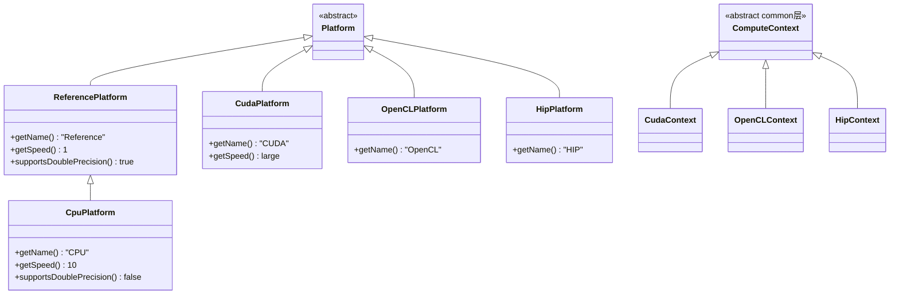
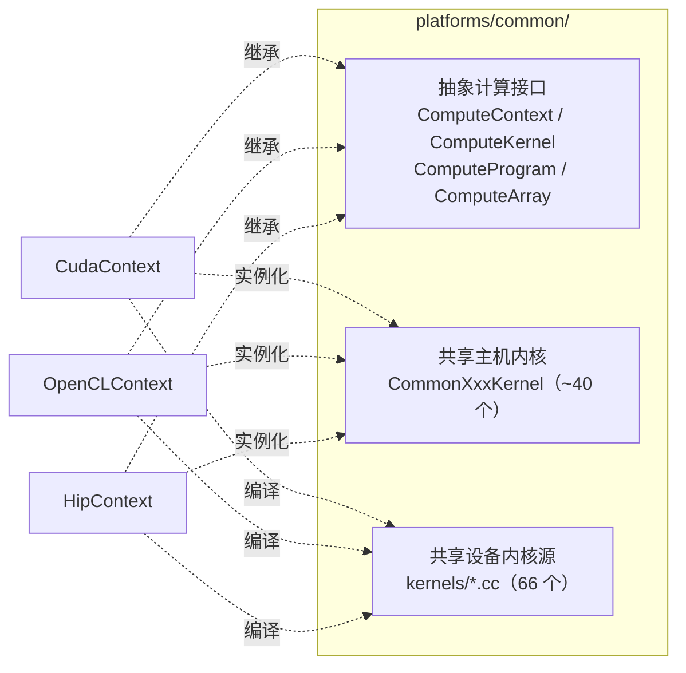

# 04 · 六个平台后端剖析（platforms/）

本篇逐平台剖析 `https://github.com/openmm/openmm/blob/master/platforms/` 下的 6 个后端。**重点是 common + CUDA/HIP 范式**——这是 NPU 后端最该模仿的模板。

## 4.1 平台总览



| 平台 | 目录 | 注册方式 | speed | 双精度 | 内核源码扩展 |
|------|------|---------|-------|--------|-------------|
| Reference | `platforms/reference/` | 静态（编译进核心库） | 1 | 是 | 纯 C++ |
| CPU | `platforms/cpu/` | 插件（需 SSE4.1） | 10 | 否 | 纯 C++ + SIMD |
| common | `platforms/common/` | **非独立平台** | — | — | `.cc`（共享） |
| CUDA | `platforms/cuda/` | 插件 | 高 | 视设备 | `.cu` |
| OpenCL | `platforms/opencl/` | 插件 | 高 | 视设备 | `.cl` |
| HIP | `platforms/hip/` | 插件 | 高 | 视设备 | `.hip` |

## 4.2 Reference 平台 —— 可移植正确性基准

**目录**：`platforms/reference/`

### 4.2.1 角色

- **纯 C++ 可移植参考实现**，全双精度，无 SIMD、无 GPU
- `getSpeed()==1`，是所有 `getSpeed()` 的基准
- **唯一编译进核心库的平台**，静态注册于 `olla/src/Platform.cpp:59-68`
- 是所有其它平台的**正确性验证基线**——每个平台的测试都用 Reference 对照
- `CpuPlatform` 继承自它，复用未向量化的内核

### 4.2.2 结构

```
platforms/reference/
├── include/
│   ├── ReferencePlatform.h          # 平台类
│   ├── ReferenceKernelFactory.h
│   ├── ReferenceKernels.h           # 所有 ReferenceCalcXxxKernel 声明
│   └── Reference*Ixn.h              # 力交互类（ReferenceLJCoulombIxn 等）
└── src/
    ├── ReferencePlatform.cpp        # 构造时注册 ~45 个内核名
    ├── ReferenceKernelFactory.cpp   # if/else 链返回 new ReferenceCalcXxxKernel
    ├── ReferenceKernels.cpp         # 内核实现，委托 SimTKReference/
    └── SimTKReference/              # ~50 个数值实现文件
        ├── ReferenceLJCoulombIxn.cpp
        ├── ReferenceCustomNonbondedIxn.cpp
        ├── ReferencePME.cpp
        ├── ReferenceVerletDynamics.cpp
        ├── ReferenceConstraints.cpp
        └── ...
```

### 4.2.3 内核组织

- `ReferencePlatform` 构造函数（`ReferencePlatform.cpp:41-87`）创建一个 `ReferenceKernelFactory`，为 ~45 个内核名注册
- `ReferenceKernelFactory::createKernelImpl()` 按 `name` 返回 `new ReferenceCalcXxxKernel(...)`
- 内核实现在 `ReferenceKernels.cpp`，委托 `SimTKReference/*Ixn.cpp` 做数值
- `PlatformData` 持有 `vector<Vec3>` 位置/速度/力、`ReferenceConstraints`、`ThreadPool`、周期盒

### 4.2.4 PME 的 FFT

Reference 平台 PME 用 `libraries/pocketfft/`（头文件级 FFT）。GPU 平台用 `libraries/vkfft/`。

## 4.3 CPU 平台 —— SIMD + 多线程

**目录**：`platforms/cpu/`

### 4.3.1 关键设计

- **`class CpuPlatform : public ReferencePlatform`**（继承！）—— 复用 Reference 的约束、虚拟位点、PlatformData、ThreadPool，只覆盖它向量化的内核
- `getSpeed()==10`、`supportsDoublePrecision()==false`（内部 float）
- `isProcessorSupported()` 要求 SSE4.1（`isVec4Supported()`）

### 4.3.2 内核覆盖策略

`CpuKernelFactory`（`platforms/cpu/src/CpuKernelFactory.cpp`）**只创建**它向量化的内核：
- `CalcForcesAndEnergyKernel`、`UpdateStateDataKernel`
- `CalcHarmonicAngleForceKernel`、`CalcPeriodicTorsionForceKernel`、`CalcRBTorsionForceKernel`
- `CalcNonbondedForceKernel`、`CalcCustomNonbondedForceKernel`、`CalcConstantPotentialForceKernel`
- `CalcGBSAOBCForceKernel`、`CalcCustomGBForceKernel`、`CalcGayBerneForceKernel`、`CalcLCPOForceKernel`
- `CalcCustomManyParticleForceKernel`、`IntegrateLangevinMiddleStepKernel`

其余内核名（键、CustomTorsion、Verlet/Brownian/variable 积分器、恒温器、恒压器等）**不注册** `CpuKernelFactory`，由继承自 `ReferencePlatform` 基类构造注册的 `ReferenceKernelFactory` 兜底。

**这是 OpenMM 内核分发的优雅之处**：`Platform::createKernel` 查本平台 `kernelFactories` map，找不到则——对 CPU 平台——沿继承链由 Reference 的工厂提供。

### 4.3.3 SIMD 向量化

- 向量类型 `fvec4`/`fvec8`/`ivec` 在 `openmmapi/include/openmm/internal/vectorize*.h` 定义
- `vectorize.h` 是调度器：ARM→`vectorize_neon.h`、PPC→`vectorize_ppc.h`、x86 SSE→`vectorize_sse.h`、回退→`vectorize_portable.h`；`vectorizeAvx.h`/`vectorizeAvx2.h` 扩展到 256 位
- 重力循环模板化于 `FVEC` 类型：`template<typename FVEC> class CpuNonbondedForceFvec`（`platforms/cpu/include/CpuNonbondedForceFvec.h`）
- 三个具体 TU 分别实例化：`CpuNonbondedForceVec4.cpp`（SSE）、`CpuNonbondedForceAvx.cpp`（AVX）、`CpuNonbondedForceAvx2.cpp`（AVX2），每个 TU 用对应 `-mavx`/`-mavx2` 编译
- 运行时调度（`CpuNonbondedForceFvec.cpp::createCpuNonbondedForceVec`）按 `isAvx2Supported()`/`isAvxSupported()` 选 AVX2→AVX→Vec4
- 超越函数用 `libraries/vecmath/`（`sse_mathfun.h`/`neon_mathfun.h`）

### 4.3.4 多线程

- `ReferencePlatform::PlatformData` 持有 `ThreadPool threads`（定义于 `openmmapi/include/openmm/internal/ThreadPool.h`）
- 线程数默认 `getNumProcessors()`，可用环境变量 `OPENMM_CPU_THREADS` 或平台属性 `Threads` 覆盖
- `CpuPlatform::PlatformData` 持有 `vector<AlignedArray<float>> threadForce`——每线程私有力缓冲，避免假共享/原子，最后归约
- `CpuRandom` 提供每线程独立 RNG 流
- 平台属性 `DeterministicForces` 可牺牲少量性能换取更可复现的力求和

### 4.3.5 NPU 适配启示

CPU 平台"继承 Reference + 选择性覆盖"的模式不太适合 NPU（NPU 是异构设备）。NPU 应模仿 GPU 平台（4.5–4.7）——独立 `Platform` 子类 + `common/` 复用。

## 4.4 common 平台 —— 共享 GPU 计算层 ★

**目录**：`platforms/common/`

**这是 NPU 适配者最该研究的一层。** 它不是独立平台（无 `CommonPlatform` 类、无 `registerPlatforms`），而是 CUDA/OpenCL/HIP **共享的代码库**。

### 4.4.1 提供的三类资产



#### (1) 抽象计算接口

`platforms/common/include/openmm/common/`：

| 头 | 抽象类 | 作用 |
|----|--------|------|
| `ComputeContext.h` | `ComputeContext` | 设备上下文：编译程序、执行内核、管理设备数组、工作线程、力信息、键合/非键工具 |
| `ComputeKernel.h` | `ComputeKernel`/`ComputeKernelImpl` | 单个设备内核句柄：`addArg/setArg/execute(size)` |
| `ComputeProgram.h` | `ComputeProgram` | 编译后的程序，产出 `ComputeKernel` |
| `ComputeArray.h` | `ComputeArray` | 设备端数组封装 |
| `ComputeEvent.h`、`ComputeQueue.h` | 事件/队列 | 异步执行 |
| `ComputeSort.h` | 排序 | 设备端基数排序 |
| `ComputeParameterSet.h` | 参数集 | 全局/每粒子参数管理 |
| `ComputeForceInfo.h` | 力信息 | 跟踪粒子重排 |
| `BondedUtilities.h` | 键合工具 | 注册键合力内核片段 |
| `NonbondedUtilities.h` | 非键工具 | 邻居表、对相互作用内核 |
| `IntegrationUtilities.h` | 积分工具 | 约束、随机数、坐标更新 |
| `ExpressionUtilities.h` | 表达式工具 | Lepton 表达式转设备代码 |
| `FFT3D.h` | 3D FFT | PME 用 |
| `ContextSelector.h` | 上下文选择器 | 多设备时选当前流 |

`CudaContext`、`OpenCLContext`、`HipContext` 都继承 `ComputeContext`（已验证：`platforms/cuda/include/CudaContext.h:66`、`platforms/opencl/include/OpenCLContext.h:122`、`platforms/hip/include/HipContext.h:74`）。

#### (2) 共享主机内核

`platforms/common/src/Common*Kernels.{cpp,h}`：约 40 个 `CommonXxxKernel` 类，是 `kernels.h` 抽象接口的子类，实现**主机侧逻辑**（编排设备内核、拷贝数据、归约）。同一份 `CommonKernels.cpp` 被编译进所有三个 GPU 平台。

部分列表：
- `CommonUpdateStateDataKernel`、`CommonApplyConstraintsKernel`、`CommonVirtualSitesKernel`、`CommonMinimizeKernel`
- `CommonCalcHarmonicBondForceKernel`、`CommonCalcNonbondedForceKernel`、`CommonCalcCustomNonbondedForceKernel`、`CommonCalcGBSAOBCForceKernel`、...
- `CommonIntegrateVerletStepKernel`、`CommonIntegrateLangevinMiddleStepKernel`、`CommonIntegrateCustomStepKernel`、`CommonIntegrateNoseHooverStepKernel`、`CommonIntegrateQTBStepKernel`、...
- `CommonApplyAndersenThermostatKernel`、`CommonApplyMonteCarloBarostatKernel`、`CommonRemoveCMMotionKernel`

#### (3) 共享设备内核源

`platforms/common/src/kernels/*.cc` —— **66 个文件**，用平台无关方言编写（用宏 `KERNEL`/`GLOBAL`/`GLOBAL_ID`/`real`/`make_float4` 等抽象），每个后端的 `common.{cu,cl,hip}` 重新定义这些宏以适配本平台编译器。

代表文件：
- 键合：`harmonicBondForce.cc`、`angleForce.cc`、`torsionForce.cc`、`cmapTorsionForce.cc`
- 非键：`nonbondedParameters.cc`、`pme.cc`、`ewald.cc`、`customNonbonded.cc`
- 隐式溶剂：`gbsaObc2.cc`
- 积分：`verlet.cc`、`langevinMiddle.cc`、`noseHooverIntegrator.cc`、`qtb.cc`
- 工具：`integrationUtilities.cc`、`constraints.cc`、`monteCarloBarostat.cc`、`andersenThermostat.cc`、`minimize.cc`、`pointFunctions.cc`、`copyCoordinateBuffers.cc`

### 4.4.2 设备内核源码嵌入机制

`cmake_modules/EncodeKernelFiles.cmake`（30 行）：
- glob `kernels/*.<ext>` 文件
- 转义反斜杠/引号/换行为 C 字符串字面量
- 拼成 `const string <Class>::<basename> = "...";` 写入生成的 `.cpp`（由 `*.cpp.in` 模板）
- 同时生成 `.h`（由 `*.h.in`）声明 `static const std::string <basename>;`

结果：文件 basename 成为 C++ 标识符。如 `harmonicBondForce.cc` → `CommonKernelSources::harmonicBondForce`。

主机代码使用：
```cpp
cc.compileProgram(CommonKernelSources::harmonicBondForce, defines);
```
`ComputeContext`（`CudaContext` 等）会前置自己的 `common.{cu,cl,hip}` 宏层 + 平台原语，再喂给本平台编译器。

### 4.4.3 为什么 common 不是独立平台

- 它没有具体设备——`ComputeContext` 是纯抽象，不能实例化
- 它的 `CommonXxxKernel` 需要一个具体的 `CudaContext`/`OpenCLContext`/`HipContext` 才能工作
- 它是**代码复用层**，不是运行时实体

**NPU 适配核心策略**：新建 `NpuContext : public ComputeContext` + `NpuPlatform : public Platform`，让 `NpuKernelFactory` 返回 `CommonXxxKernel` 实例（用 `NpuContext` 构造）。这样约 40 个内核直接复用，只需实现 `NpuContext` 下的设备原语 + 5 个左右平台特定内核。详见 [11-npu-adaptation-guide.md](11-npu-adaptation-guide.md)。

## 4.5 CUDA 平台

**目录**：`platforms/cuda/`

### 4.5.1 结构

```
platforms/cuda/
├── include/    CudaPlatform.h, CudaKernelFactory.h, CudaKernels.h,
│               CudaContext.h, CudaArray.h, CudaProgram.h, CudaKernel.h,
│               CudaBondedUtilities.h, CudaNonbondedUtilities.h, CudaIntegrationUtilities.h,
│               CudaExpressionUtilities.h, CudaFFT3D.h, CudaSort.h, CudaParallelKernels.h
├── src/        同名 .cpp + CudaKernelSources.{cpp.in,h.in}
│   └── kernels/   9 个 .cu 文件
└── tests/      TestCuda*.cpp
```

### 4.5.2 平台类

`CudaPlatform`（`platforms/cuda/src/CudaPlatform.cpp`）：
- `getName()=="CUDA"`，导出 `registerPlatforms()`（`:51-60`）调用 `Platform::registerPlatform(new CudaPlatform())`
- 平台属性：`DeviceIndex`、`DeviceName`、`UseBlockingSync`、`Precision`（`single`/`mixed`/`double`）、`UseCpuPme`、`TempDirectory`、`DisablePmeStream`、`DeterministicForces`

### 4.5.3 内核工厂策略

`CudaKernelFactory::createKernelImpl()` 对**绝大多数内核名**返回 `CommonXxxKernel`（用 `CudaContext&` 构造）。仅以下少数是 CUDA 专属：
- `CudaCalcForcesAndEnergyKernel`
- `CudaCalcNonbondedForceKernel`（优化的对相互作用）
- `CudaCalcConstantPotentialForceKernel`
- `CudaCalcCustomCVForceKernel`
- `CudaCalcATMForceKernel`
- `CudaParallelCalcForcesAndEnergyKernel` / `CudaParallelCalcNonbondedForceKernel`（多 GPU）

多设备时，工厂把 common 内核包进 `CommonParallelXxxKernel` 适配器。

### 4.5.4 设备内核源

`platforms/cuda/src/kernels/*.cu`（9 个）：
- `common.cu` —— **宏层**：定义 `KERNEL`/`GLOBAL`/`LOCAL`/`GLOBAL_ID`/`real`/`mixed`/`make_float4` 等映射到 CUDA
- `nonbonded.cu` —— 优化的对相互作用内核
- `findInteractingBlocks.cu` —— 邻居块发现
- `fft.cu`、`fftR2C.cu` —— FFT（配合 vkfft）
- `sort.cu` —— 基数排序
- `utilities.cu`、`vectorOps.cu`、`parallel.cu`

加上共享的 `platforms/common/src/kernels/*.cc`（66 个），覆盖全部物理。

## 4.6 OpenCL 平台

**目录**：`platforms/opencl/`（结构镜像 CUDA）

- `OpenCLPlatform`，`getName()=="OpenCL"`
- 内核源 `platforms/opencl/src/kernels/*.cl`（10 个）
- `common.cl` 是宏层；另有 `*_cpu.cl` 变体（`nonbonded_cpu.cl`、`findInteractingBlocks_cpu.cl`）在 OpenCL 设备是 CPU 时选用
- 内核工厂策略同 CUDA：绝大多数返回 `CommonXxxKernel`，少数 OpenCL 专属
- 用 `find_package(OpenCL)`（`cmake_modules/FindOpenCL.cmake`）检测

## 4.7 HIP 平台

**目录**：`platforms/hip/`（结构镜像 CUDA）

- `HipPlatform`，`getName()=="HIP"`，由 Stanford + AMD 联合版权
- 内核源 `platforms/hip/src/kernels/*.hip`（8 个）
- `common.hip` 宏层 + `intrinsics.hip` 内建函数映射
- 用 `find_package(HIP CONFIG)`（搜索 `$ROCM_PATH`、`/opt/rocm`）检测
- 内核工厂策略同 CUDA

## 4.8 GPU 平台共有的设备上下文职责

每个 GPU 后端的 `*Context`（继承 `ComputeContext`）必须实现：

1. **设备管理**：选择设备、创建上下文/流
2. **数组管理**：`ComputeArray` 实现——设备内存分配/拷贝/映射
3. **程序编译**：`compileProgram(source, defines)` —— 前置宏层 + 平台原语，调本平台编译器（nvcc/opencl JIT/hip-clang）
4. **内核执行**：`ComputeKernel` 实现——`addArg/setArg/execute(size)`
5. **排序**：`ComputeSort` 实现（基数排序，用于邻居表/粒子重排）
6. **FFT**：`FFT3D` 实现（用 `libraries/vkfft/`）
7. **工具子系统**：实例化 `BondedUtilities`、`NonbondedUtilities`、`IntegrationUtilities`、`ExpressionUtilities`
8. **内核缓存**：用 `libraries/csha1/` 哈希内核源码字符串，缓存编译产物（磁盘/内存）
9. **粒子重排**：用 Hilbert 曲线（`libraries/hilbert/`）重排粒子提升空间局部性

## 4.9 各平台测试

每个平台 `tests/` 目录有 `Test<Platform>*.cpp`，用 Reference 做对照验证。测试框架：CTest + `openmmapi/include/openmm/internal/AssertionUtilities.h` 的 `ASSERT_EQUAL_TOL` 等宏。OpenMM 顶层 `CMakeLists.txt:316-320` 条件加 `platforms/reference/tests`。

## 4.10 NPU 平台该模仿谁

**结论：模仿 CUDA/HIP + 复用 common。**

具体而言，NPU 平台应：
1. 新建 `platforms/npu/`，结构镜像 `platforms/hip/`
2. 实现 `NpuPlatform : public Platform` + `NpuKernelFactory`
3. 实现 `NpuContext : public ComputeContext`（核心工作量）
4. 提供 `platforms/npu/src/kernels/*.npu`（设备内核，用 NPU 编程模型如 CANN ACL/Ascend C），含 `common.npu` 宏层
5. `NpuKernelFactory` 对绝大多数内核返回 `CommonXxxKernel`（用 `NpuContext` 构造），仅手写 `NpuCalcNonbondedForceKernel` 等少数
6. 用 `EncodeKernelFiles.cmake` 嵌入 `.npu` 源码为字符串
7. 导出 `registerPlatforms()`，设置 `getSpeed()` 大于 10

详细步骤见 [11-npu-adaptation-guide.md](11-npu-adaptation-guide.md)。

下一篇 [05-plugins.md](05-plugins.md) 讲功能扩展插件。
