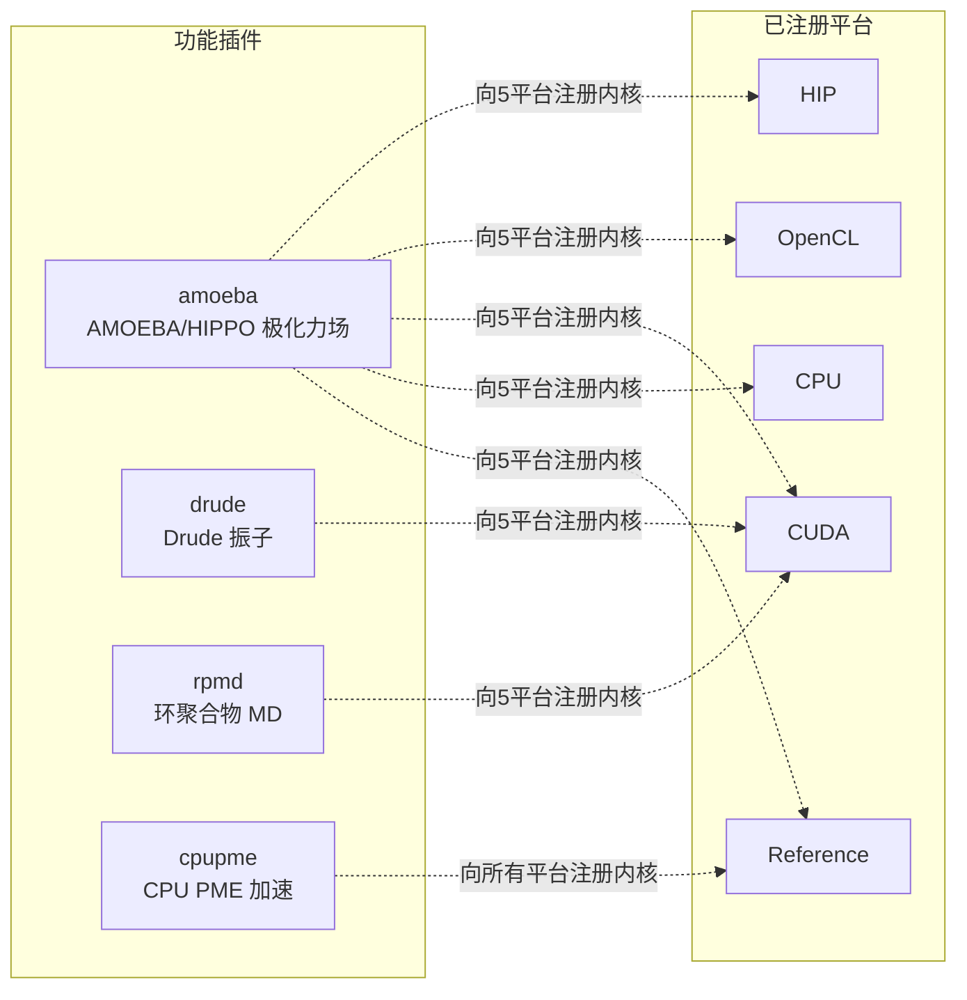
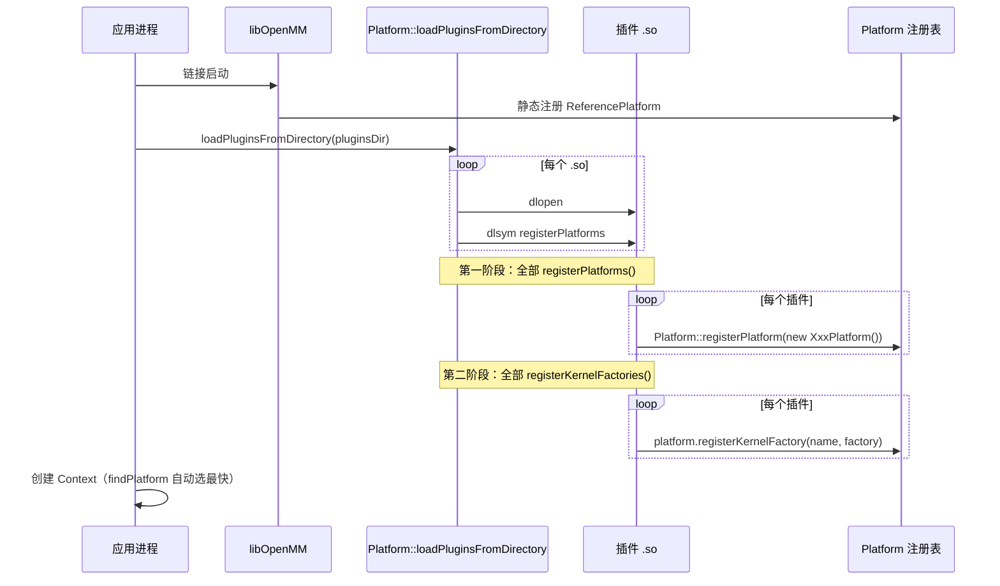

# 05 · 插件机制（plugins/）

OpenMM 的"插件"有两类：
- **平台插件**（platforms/ 下的 CPU/CUDA/OpenCL/HIP）：新增一个 `Platform` 后端
- **功能插件**（plugins/ 下的 amoeba/drude/rpmd/cpupme）：向**已注册平台**追加 `Force`/`Integrator` 及其内核，不新增平台

本篇讲第二类。它们都遵循 03 篇所述的两阶段自注册：导出 `registerPlatforms()`（通常空）+ `registerKernelFactories()`。

## 5.1 插件总览



每个插件目录结构相似：
```
plugins/<name>/
├── openmmapi/
│   ├── include/openmm/   # 新增的 Force/Integrator 头 + <name>Kernels.h
│   └── src/              # 实现 + ForceImpl
├── platforms/common/src/ # 共享 GPU 内核（CommonXxxKernels.cpp + kernels/*.cc）
├── platforms/cuda/src/   # CUDA 专属工厂 + 内核
├── platforms/opencl/src/ # OpenCL 专属工厂 + 内核
├── platforms/hip/src/    # HIP 专属工厂 + 内核
├── platforms/reference/src/ # Reference 专属工厂 + 内核
└── serialization/        # （可选）XML 序列化代理
```

## 5.2 amoeba —— AMOEBA / HIPPO 极化力场

**目录**：`plugins/amoeba/`

### 5.2.1 物理功能

- AMOEBA 极化多极力场：原子多极（电荷/偶极/四极）+ 互感偶极
- AMOEBA VdW（buffered 14-7）
- WCA 色散
- Generalized Kirkwood 隐式溶剂
- Torsion-Torsion（类 CMAP 2D 耦合）
- **HIPPO** 力场（新一代，重叠粒子相互作用）

### 5.2.2 注册的类与内核

Force 子类（`plugins/amoeba/openmmapi/include/openmm/`）：
- `AmoebaMultipoleForce`、`AmoebaVdwForce`、`AmoebaGeneralizedKirkwoodForce`、`AmoebaWcaDispersionForce`、`AmoebaTorsionTorsionForce`
- `HippoNonbondedForce`

内核名声明（`amoebaKernels.h`）：
- `CalcAmoebaMultipoleForceKernel`、`CalcAmoebaVdwForceKernel`、`CalcAmoebaGeneralizedKirkwoodForceKernel`、`CalcAmoebaWcaDispersionForceKernel`、`CalcAmoebaTorsionTorsionForceKernel`、`CalcHippoNonbondedForceKernel`

### 5.2.3 各平台实现

每个 GPU 平台有 `Amoeba<Platform>KernelFactory.cpp` + `Amoeba<Platform>Kernels.cpp`：
- `platforms/cuda/src/AmoebaCudaKernelFactory.cpp` —— 向 "CUDA" 平台注册 6 个内核工厂
- CUDA 专属：`CudaCalcAmoebaMultipoleForceKernel`、`CudaCalcHippoNonbondedForceKernel`；其余用共享 `CommonCalc...`
- 共享 GPU 内核：`platforms/common/src/AmoebaCommonKernels.{cpp,h}` + `kernels/*.cc`（`multipoleElectrostatics.cc`、`multipoleInducedField.cc`、`hippoNonbonded.cc`、`hippoInteraction.cc` 等）
- CUDA 专属 `.cu`：`multipoleInducedField.cu`、`multipolePme.cu`
- Reference：`platforms/reference/src/AmoebaReferenceKernelFactory.cpp` + `SimTKReference/AmoebaReference*Force.{cpp,h}`

### 5.2.4 序列化

`plugins/amoeba/serialization/` 提供 `AmoebaMultipoleForceProxy`、`HippoNonbondedForceProxy` 等 XML 代理。

### 5.2.5 关键文件

- `plugins/amoeba/openmmapi/include/openmm/AmoebaMultipoleForce.h`、`HippoNonbondedForce.h`、`amoebaKernels.h`
- `plugins/amoeba/openmmapi/src/*ForceImpl.cpp`
- `plugins/amoeba/platforms/common/src/AmoebaCommonKernels.cpp` + `kernels/*.cc`
- `plugins/amoeba/platforms/{cuda,opencl,hip,reference}/src/Amoeba*KernelFactory.cpp`

## 5.3 drude —— Drude 振子（可极化模型）

**目录**：`plugins/drude/`

### 5.3.1 物理功能

Drude 振子诱导极化模型：每个可极化原子挂一个 Drude 粒子（弹簧连接 + Thole 阻尼）。配套专用积分器：Drude 粒子与母原子分别恒温（冷 Drude vs 热母原子），以及自洽场（SCF）积分器。

### 5.3.2 注册的类与内核

- `DrudeForce`（弹簧 + Thole 参数）—— `CalcDrudeForceKernel`
- `DrudeLangevinIntegrator` —— `IntegrateDrudeLangevinStepKernel`
- `DrudeSCFIntegrator` —— `IntegrateDrudeSCFStepKernel`
- `DrudeNoseHooverIntegrator`、`DrudeIntegrator`（基类）
- `DrudeHelpers.cpp`：Drude 粒子约束/硬墙逻辑
- 内核名：`plugins/drude/openmmapi/include/openmm/DrudeKernels.h`

### 5.3.3 各平台实现

- `platforms/cuda/src/CudaDrudeKernelFactory.cpp`：向 CUDA 注册 3 个内核，实现用共享 `CommonCalcDrudeForceKernel` 等
- 共享 GPU 内核：`platforms/common/src/CommonDrudeKernels.{cpp,h}` + `kernels/`（`drudePairForce.cc`、`drudeParticleForce.cc`、`drudeLangevin.cc`、`drudeSCF.cc`）
- 各 GPU 平台 + Reference 各有 `*DrudeKernelFactory.cpp`

### 5.3.4 序列化

`plugins/drude/serialization/` 提供 `DrudeForceProxy` 及 Drude 积分器代理。

## 5.4 rpmd —— 环聚合物分子动力学

**目录**：`plugins/rpmd/`

### 5.4.1 物理功能

环聚合物 MD（Ring-Polymer MD）：路径积分方法，把每个核表示成一串"珠"（beads）的环聚合物，以纳入核量子效应（隧穿、零点能）。含 `RPMDMonteCarloBarostat` 用于 RPMD 下的压力耦合。

### 5.4.2 注册的类与内核

- `RPMDIntegrator` —— `IntegrateRPMDStepKernel`
- `RPMDMonteCarloBarostat`（Force/Updater）+ `RPMDUpdater`
- 内核名：`plugins/rpmd/openmmapi/include/openmm/RpmdKernels.h`

### 5.4.3 各平台实现

- 共享 GPU 内核：`platforms/common/src/CommonRpmdKernels.{cpp,h}` + `kernels/rpmd.cc`、`kernels/rpmdContraction.cc`
- 各平台 `*RpmdKernelFactory.cpp`

### 5.4.4 序列化

无 `serialization/` 子目录（RPMD 积分器/恒压器一般不持久化进 System）。

## 5.5 cpupme —— CPU 加速 PME

**目录**：`plugins/cpupme/`

### 5.5.1 物理功能

为 `NonbondedForce` 的 PME 提供**优化的 CPU 实现**：电静电 PME 倒易空间部分 + LJ 色散 PME 倒易空间部分。它不新增 Force/Integrator，而是**覆盖现有 `NonbondedForce` 的内核**，向**所有**已注册平台注册（遍历 `Platform::getNumPlatforms()`）。

用途：让 GPU 平台把 PME 的 FFT/倒易步骤 offload 到多线程 CPU（GPU+CPU 协同），由平台属性 `UseCpuPme` 控制。门控：`CpuCalcPmeReciprocalForceKernel::isProcessorSupported()`。

### 5.5.2 注册的内核

- `CalcPmeReciprocalForceKernel`
- `CalcDispersionPmeReciprocalForceKernel`

### 5.5.3 关键文件

- `plugins/cpupme/src/CpuPmeKernelFactory.cpp` —— 遍历所有平台注册
- `plugins/cpupme/src/CpuPmeKernels.{cpp,h}` —— 实现
- `plugins/cpupme/include/internal/windowsExportPme.h`

## 5.6 插件与平台的协作模式



## 5.7 NPU 适配启示

1. **新 NPU 平台可作为"平台插件"**：导出 `registerPlatforms()` 注册 `NpuPlatform`，自动进入候选
2. **若 NPU 力场有特殊算法**（如 NPU 友好的多极计算），可做成**功能插件**向 NPU 平台追加内核（模仿 amoeba）
3. **插件可向多个平台注册同一内核**：cpupme 模式——若你写了一个 NPU+CPU 混合 PME，可向所有平台注册
4. **插件目录布局可参照 amoeba**：`openmmapi/` + 每平台 `platforms/<plat>/src/` + 共享 `platforms/common/src/`

下一篇 [06-serialization.md](06-serialization.md) 讲状态持久化。
