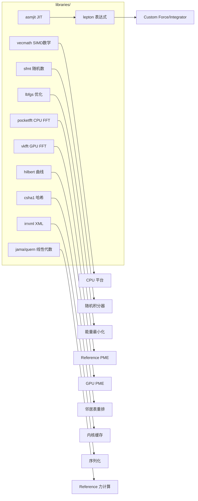

# 07 · 第三方库（libraries/）

OpenMM 在 `libraries/` 下内置 11 个第三方库，全部随源码编译进 `libOpenMM`，无外部运行时依赖（除 CUDA/OpenCL/HIP SDK）。本篇逐库说明用途，**重点标注对 NPU 适配有影响的库**。

## 7.1 总览



## 7.2 逐库说明

### 7.2.1 lepton —— 表达式解析求值 ★

**目录**：`libraries/lepton/`

Lepton 是 OpenMM 自研的轻量数学表达式解析器（作者 Peter Eastman）。核心类：`Parser`、`ParsedExpression`、`ExpressionProgram`、`CompiledExpression`、`Operation`、`ExpressionTreeNode`。

**用途**：驱动所有 `Custom*Force` 和 `CustomIntegrator`。用户输入的字符串（如 `"0.5*k*(r-r0)^2"`）被解析、优化，再：
- CPU：经 asmjit JIT 编译为本地机器码
- GPU：转译为设备内核源码（CUDA/OpenCL/HIP），在线编译

**NPU 适配影响**：NPU 平台若复用 `common/` 的 `ExpressionUtilities`，自定义力的表达式会被转成设备源码字符串，由 `NpuContext::compileProgram` 编译。NPU 编译器需支持 Lepton 生成的子集（基本算术 + 内建函数 `sqrt/exp/log/sin/cos/...`）。

### 7.2.2 vecmath —— SIMD 向量化数学

**目录**：`libraries/vecmath/`

提供向量化的超越函数：`sse_mathfun.h`（x86 SSE）、`neon_mathfun.h`（ARM NEON）。

**用途**：CPU 平台的非键力内核 + Lepton 向量化表达式求值。

**构建条件**：仅 X86 或 ARM 时编译（顶层 `CMakeLists.txt:93-95`）。

**NPU 适配影响**：无（仅 CPU 用）。

### 7.2.3 asmjit —— JIT 汇编器 ★

**目录**：`libraries/asmjit/`

AsmJit 是轻量 JIT 汇编库（x86/x64 + ARM/AArch64，MIT）。支持核心 + 多后端。

**用途**：
- Lepton 的 `CompiledExpression` 用它把解析后的表达式 JIT 成本地机器码，避免解释执行开销
- CPU 平台自定义力/积分器表达式的高性能求值

**构建条件**：X86/ARM 且非 Windows 静态库时编译，定义 `-DLEPTON_USE_JIT`（`CMakeLists.txt:243-250`）。

**NPU 适配影响**：无直接关系（NPU 表达式走设备编译，不走 asmjit）。

### 7.2.4 sfmt —— 随机数生成器

**目录**：`libraries/sfmt/`

SIMD-oriented Fast Mersenne Twister（SFMT 1.3.3，Mutsuo Saito & Makoto Matsumoto，BSD）。

**用途**：所有随机积分器（Langevin、Brownian、DPD、Andersen 恒温器、MC 恒压器）+ 速度初始化的高质量随机源。

**构建**：X86 时 `HAVE_SSE2=1`（`CMakeLists.txt:238`）。

**NPU 适配影响**：NPU 平台若用 `common/` 的 `IntegrationUtilities`，随机数由该工具在设备端生成（GPU 用设备端 SFMT 内核）。NPU 需提供等价设备端 RNG 内核，或让 `NpuIntegrationUtilities` 在主机生成后拷贝。

### 7.2.5 lbfgs —— L-BFGS 优化器

**目录**：`libraries/lbfgs/`

有限内存 BFGS（Jorge Nocedal / Naoaki Okazaki，MIT）。

**用途**：`LocalEnergyMinimizer` 背后的拟牛顿最小化器。X86 时 `USE_SSE`（`CMakeLists.txt:239`）。

**NPU 适配影响**：最小化内核（`MinimizeKernel`）在 GPU 平台用 `common/` 的 `CommonMinimizeKernel`（设备端 L-BFGS），主机侧 lbfgs 主要供 Reference/CPU。NPU 复用 common 即可。

### 7.2.6 pocketfft —— 轻量 FFT

**目录**：`libraries/pocketfft/`

PocketFFT，单头文件 `pocketfft_hdronly.h`。

**用途**：Reference 平台 PME 的 FFT + CPU 侧 PME 参考。

**NPU 适配影响**：NPU 平台 PME 应用 GPU FFT 库（参照 vkfft），不用 pocketfft。

### 7.2.7 vkfft —— GPU FFT ★

**目录**：`libraries/vkfft/`

VkFFT 头文件（`vkFFT.h`），支持 Vulkan/CUDA/HIP/OpenCL 后端。

**用途**：CUDA/OpenCL/HIP 平台 PME 的加速 FFT，统一替代 cufft/clFFT。

**NPU 适配影响**：**关键依赖**。NPU 平台 PME 需要 3D FFT。两条路：
1. 让 vkfft 支持 NPU 后端（若 vkfft 已支持 Ascend）
2. 在 `NpuFFT3D` 中调用 NPU 厂商 FFT 库（如 CANN 的 FFT 接口），实现 `FFT3D` 抽象接口（`platforms/common/include/openmm/common/FFT3D.h`）

### 7.2.8 hilbert —— Hilbert 空间填充曲线

**目录**：`libraries/hilbert/`

C 实现，`hilbert.h` 提供 `hilbert_i2c`/`hilbert_c2i`（索引↔坐标转换）。

**用途**：邻居表构建（`CpuNeighborList.cpp`、`ComputeContext.cpp`）按 Hilbert 曲线重排粒子，提升空间局部性/缓存命中。

**NPU 适配影响**：若 NPU 邻居表用类似空间重排策略，可复用。`common/` 的 `NonbondedUtilities` 已处理，复用即可。

### 7.2.9 csha1 —— SHA-1 哈希

**目录**：`libraries/csha1/`

SHA-1（Dominik Reichl，公有领域）。

**用途**：GPU 平台（`CudaContext.cpp`、`HipContext.cpp`）哈希编译的内核源码字符串，作为内核缓存键（避免重复编译）。

**NPU 适配影响**：NPU 平台若实现内核缓存（强烈建议，因 NPU 编译慢），可复用 csha1。

### 7.2.10 irrxml —— XML 解析

**目录**：`libraries/irrxml/`

irrXML 1.2（Irrlicht 项目，zlib 许可）。

**用途**：`XmlSerializer` 读取 XML（`serialization/src/XmlSerializer.cpp` `#include "irrXML.h"`）。

**NPU 适配影响**：无。

### 7.2.11 jama / quern —— 线性代数

**目录**：`libraries/jama/`、`libraries/quern/`

- **jama**：JAMA/TNT 模板头库（Cholesky/LU/QR/特征值/SVD + TNT 数组），头文件级。Reference 平台小矩阵分解用（多极旋转矩阵、约束求解）。
- **quern**：Robert Bridson 的稀疏 Givens QR 分解（带不完全丢弃预处理），作稀疏线性求解器/预条件子。

**NPU 适配影响**：主要供 Reference/CPU，NPU 复用 common 不直接接触。

## 7.3 构建集成

顶层 `CMakeLists.txt:92` 列出编译进 `libOpenMM` 的子目录：
```
. openmmapi olla libraries/jama libraries/quern libraries/lepton
libraries/sfmt libraries/lbfgs libraries/hilbert libraries/csha1
libraries/pocketfft libraries/vkfft platforms/reference serialization
libraries/irrxml
```
外加：
- `libraries/vecmath`（X86/ARM）
- `libraries/asmjit` + `-DLEPTON_USE_JIT`（X86/ARM 且非 Win 静态）

各库无独立 `CMakeLists.txt`，由顶层 glob `src/*.cpp` 编译。

## 7.4 NPU 适配的库依赖小结

| 库 | NPU 平台是否直接用 | 说明 |
|----|-------------------|------|
| lepton | 间接 | 通过 `common/ExpressionUtilities` 转设备源码 |
| vecmath | 否 | 仅 CPU |
| asmjit | 否 | 仅 CPU JIT |
| sfmt | 间接 | 设备端 RNG 内核需自行实现或主机生成 |
| lbfgs | 否 | common 设备端 L-BFGS |
| pocketfft | 否 | 仅 Reference |
| **vkfft** | **是（关键）** | PME 的 3D FFT，需 NPU 后端或替代 |
| hilbert | 间接 | common 已处理邻居表 |
| csha1 | 可选 | NPU 内核缓存键 |
| irrxml | 否 | 序列化用 |
| jama/quern | 否 | Reference 用 |

**最需要关注的库**：`vkfft`（PME FFT）和 `lepton`（表达式转译）。详见 [11-npu-adaptation-guide.md](11-npu-adaptation-guide.md)。

下一篇 [08-wrappers.md](08-wrappers.md) 讲语言封装。
