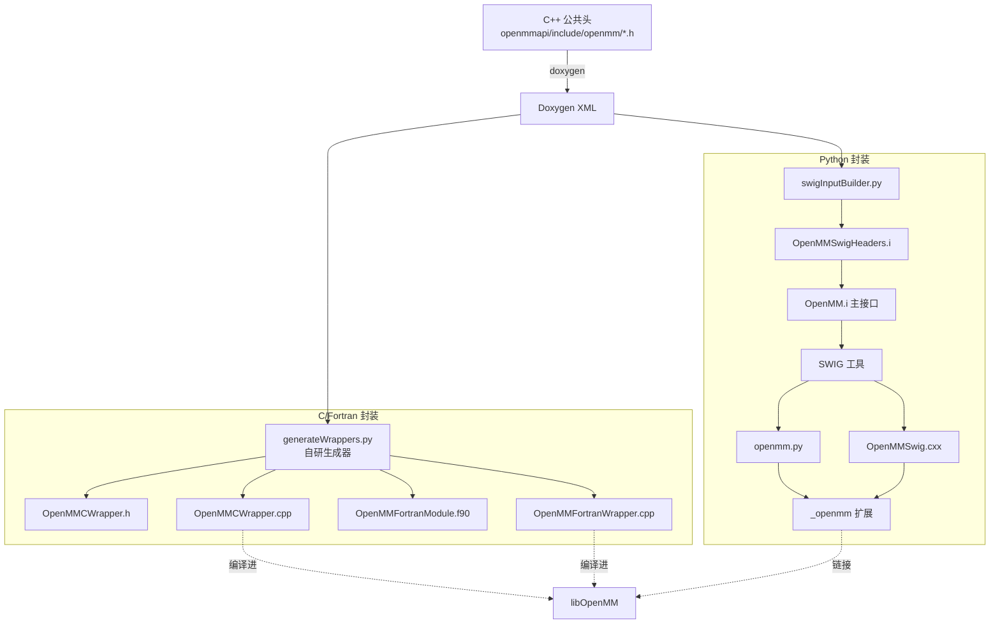
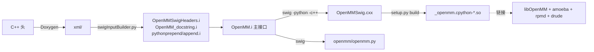

# 08 · 语言封装（wrappers/）

OpenMM 用**两套不同的代码生成策略**把 C++ API 暴露给其它语言。两者都从 **Doxygen XML** 自动生成，保证与 C++ 头文件同步。

## 8.1 封装总览



## 8.2 C / Fortran 封装（自研生成器，非 SWIG）

### 8.2.1 生成器

**路径**：`wrappers/generateWrappers.py`（2169 行）

**机制**：解析 Doxygen XML，生成 4 个文件：
- `OpenMMCWrapper.h` —— C API 头（安装到 `/include`）
- `OpenMMCWrapper.cpp` —— C API 实现，编译进 `libOpenMM`
- `OpenMMFortranModule.f90` —— Fortran 模块（`MODULE OpenMM_Types` + `MODULE OpenMM`）
- `OpenMMFortranWrapper.cpp` —— `extern "C"` 垫片，编译进 `libOpenMM`

### 8.2.2 类型映射

C++ STL 类型 → C 不透明句柄类型：

| C++ | C |
|-----|---|
| `bool` | `OpenMM_Boolean` |
| `Vec3` | `OpenMM_Vec3` |
| `std::string` | `char*` |
| `std::vector<std::string>` | `OpenMM_StringArray` |
| `std::vector<Vec3>` | `OpenMM_Vec3Array` |
| `std::vector<std::pair<int,int>>` | `OpenMM_BondArray` |
| `std::map<std::string,double>` | `OpenMM_ParameterArray` |
| `std::vector<double>` | `OpenMM_DoubleArray` |
| `std::vector<int>` | `OpenMM_IntArray` |

每个 C++ 类 → `typedef struct OpenMM_<Class>_struct OpenMM_<Class>;` 不透明指针。方法命名 `OpenMM_<Class>_<method>`，重载加 `_N` 后缀。

### 8.2.3 排除与特殊处理

`generateWrappers.py` 维护：
- `skipClasses`：`Vec3`、`XmlSerializer`、`Kernel`、`ContextImpl`、`SerializationNode`、`PythonForce` 等
- `skipMethods`：返回复杂 STL 类型或需特殊语义的方法（如 `Context::getState`、`Platform::loadPluginsFromDirectory`）
- `hideClasses`：`Kernel`、`KernelImpl`、`KernelFactory`、`ContextImpl`、`SerializationNode`、`SerializationProxy`

这些方法手写特殊封装。

### 8.2.4 Fortran 特性

`OpenMMFortranWrapper.cpp` 为每个 Fortran 符号生成**两份**：小写带尾下划线（`openmm_<...>_`）和全大写（`OPENMM_<...>`），兼容 Unix/Windows Fortran 调用约定。处理 1 起索引（`set`/`get` 减 1）、空格补齐字符串。

### 8.2.5 构建集成

`wrappers/CMakeLists.txt`：
1. `configure_file(Doxyfile.in → Doxyfile)`，输入 `openmmapi/` + `olla/include/openmm/Platform.h`，`GENERATE_XML=YES`
2. 跑 Doxygen 产 `xml/index.xml`
3. 跑 `generateWrappers.py` 产 4 文件
4. `add_custom_target(ApiWrappers)`

顶层 `CMakeLists.txt:253-258` 把 `OpenMMCWrapper.cpp` + `OpenMMFortranWrapper.cpp` 直接编进 `libOpenMM`（标记 `GENERATED TRUE`），并让 `OpenMM` 依赖 `ApiWrappers`。**所以 C/Fortran 程序只需链接 `libOpenMM`**。

## 8.3 Python 封装（SWIG + Doxygen 生成）

### 8.3.1 目录

```
wrappers/python/
├── CMakeLists.txt、setup.py、pysetup.cmake.in、MANIFEST.in
├── openmm/            # Python 包源
├── simtk/             # 向后兼容 shim 包
├── src/swig_doxygen/
│   ├── OpenMM.i               # SWIG 主接口（65 行）
│   ├── swigInputBuilder.py    # 从 Doxygen XML 生成 SWIG 输入（830 行）
│   ├── swigInputConfig.py     # 配置：SKIP_METHODS、DOC_STRINGS 等（585 行）
│   ├── doxygen/Doxyfile.in
│   └── swig_lib/python/       # 7 个手写 SWIG 片段
│       ├── typemaps.i         # ★ Python↔C++ 类型映射核心（627 行）
│       ├── features.i、exceptions.i、extend.i、header.i、
│       ├── pythoncode.i、pythonforce.i
└── tests/                     # pytest 测试
```

### 8.3.2 生成流程



`OpenMM.i` 主接口要点：
- `%module(directors="1") openmm` —— 启用 SWIG directors（Python 可子类化 `MinimizationReporter`、`CustomCPPForce`）
- `%include` STL 支持（`std_string.i`、`std_vector.i`、`std_map.i`、`std_pair.i`、`std_set.i`）+ 模板实例化
- `%{ %}` 块 include `OpenMM.h`、`OpenMMAmoeba.h`、`RPMDIntegrator.h`、`OpenMMDrude.h`、序列化头
- `%include OpenMMSwigHeaders.i`（生成的实际类声明）

### 8.3.3 typemaps.i —— Python↔C++ 映射核心 ★

`wrappers/python/src/swig_doxygen/swig_lib/python/typemaps.i`（627 行）是 Python 封装的精华：

- `Py_StripOpenMMUnits`：自动剥离 `openmm.unit.Quantity` 包装（特殊处理 `bar`）
- `Vec3_to_PyVec3` / `Py_SequenceToVec3`
- **NumPy 零拷贝快速路径**：对 C 连续的 double/float/int32/int64 数组用 `memcpy` 直传，避免逐元素拷贝
- `double`、`Vec3`、`const Vec3&`、`vector<Vec3>`、`vector<double>`、`vector<vector<double>>`、`vector<vector<vector<double>>>` 的 typemap + `typecheck` 优先级（让 SWIG 在 `double` vs `Vec3` 间正确分发）
- `Context::createCheckpoint` 返回 `bytes`；`std::string` 输入接受 str/bytes

### 8.3.4 Python 包结构

`openmm/__init__.py`：
- `from openmm.openmm import *`（SWIG 生成）
- 加 `Vec3`（`vec3.py`，namedtuple 子类）
- `MTSIntegrator`/`MTSLangevinIntegrator`（`mtsintegrators.py`）
- AMD 积分器（`amd.py`）
- 自动 `loadPluginsFromDirectory(getDefaultPluginsDirectory())`
- `registerPythonForceProxy()`

子包：
- `openmm.unit` —— 物理单位处理
- `openmm.app` —— 应用层（文件 I/O、力场）—— 注意：**`openmm.app` 不在本仓库**，在独立仓库 `openmm-openmm`（pymol 等）。本仓库的 `wrappers/python/` 只生成核心 `openmm.openmm` 绑定 + 少量 `app/internal` Cython 扩展（xtc 等）
- `simtk` —— 历史兼容 shim

### 8.3.5 构建集成

`wrappers/python/CMakeLists.txt`（317 行）：
1. 把所有源文件 staging 到 `${CMAKE_BINARY_DIR}/python`
2. 写 `openmm/version.py`（git 修订）
3. 要求 SWIG ≥ 3.0.5，跑 Doxygen 产 XML
4. 跑 `swigInputBuilder.py` 生成 `.i` 输入
5. 跑 `swig -python -c++` 产 `OpenMMSwig.cxx` + `openmm.py`
6. 跑 `python setup.py build` 编译 `_openmm` 扩展，链接 `OpenMM` + `OpenMMAmoeba` + `OpenMMRPMD` + `OpenMMDrude`
7. 自定义 target：`BuildModule`、`RunSwig`、`PythonBdist`、`PythonSdist`、`PythonBdistWheel`、`PythonInstall`

`setup.py` 用 Cython 编 `app/internal/*.pyx` + `xtc_utils`，依赖 numpy。`extras_require` 声明可选 CUDA/HIP wheel（`cuda12`、`cuda13`、`hip6`、`hip7`）。

## 8.4 两套策略对比

| 维度 | C/Fortran | Python |
|------|-----------|--------|
| 生成器 | `generateWrappers.py`（自研） | `swigInputBuilder.py`（生成 SWIG 输入）+ SWIG |
| 产物编译位置 | 直接进 `libOpenMM` | 独立 `_openmm` 扩展 |
| 链接 | C/Fortran 程序链 `libOpenMM` 即可 | Python 扩展链 `libOpenMM` + 三个插件库 |
| 类型映射 | 不透明指针 + 数组句柄 | SWIG typemap + NumPy 零拷贝 |
| directors | 无 | 有（Python 可子类化） |
| 同步机制 | 都从 Doxygen XML 生成，与 C++ 头自动同步 | 同上 |

## 8.5 NPU 适配启示

1. **语言封装层无需为 NPU 改动**：它只暴露平台无关 API，NPU 平台作为插件被 `loadPluginsFromDirectory` 自动发现
2. **Python 用户用 NPU**：`Platform.getPlatformByName("NPU")` 或自动选中（`getSpeed` 够高）
3. **若 NPU 平台有专属 Force/Integrator**（如 NPU 优化多极力），需在 `swigInputConfig.py`/`generateWrappers.py` 的 skip 列表里**不要**排除其头文件，并确保 Doxygen 能解析——通常加进 `openmmapi/include/openmm/` 即自动纳入
4. **wheel 打包**：参考 `setup.py` 的 `cuda12`/`hip6` extras，可为 NPU 加 `ascend`/`cann` extra

下一篇 [09-build-system.md](09-build-system.md) 讲 CMake 构建系统。
