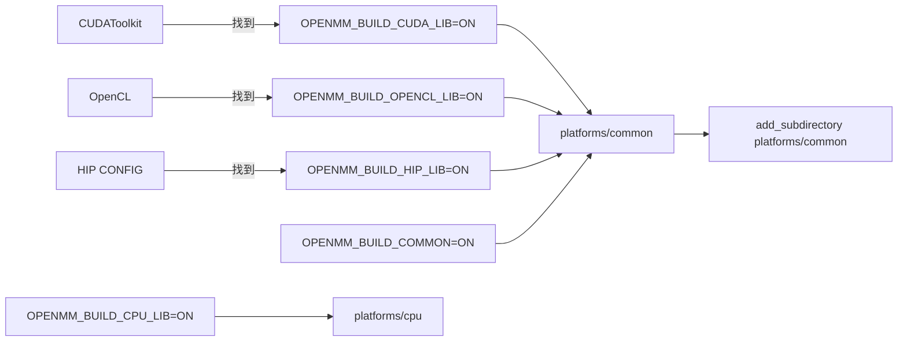

# 09 · 构建系统（CMake）

本篇梳理 OpenMM 的 CMake 构建系统，重点是**用户可见的构建选项**和**平台自动检测逻辑**——NPU 适配需要新增一个平台子目录并接入这套构建。

## 9.1 顶层 CMakeLists.txt 概览

**路径**：`https://github.com/openmm/openmm/blob/master/CMakeLists.txt`（474 行）

关键元信息：
- 版本：`OPENMM_MAJOR_VERSION 8`、`MINOR 5`、`BUILD 0`（`:158-160`）
- `CMAKE_MINIMUM_REQUIRED(VERSION 3.17)`（`:24`）
- C++ 标准：`CMAKE_CXX_STANDARD 11`（`:97`）
- 默认安装前缀：`/usr/local/openmm`（Unix）/ `%ProgramFiles%/OpenMM`（Win）（`:57-65`）

## 9.2 架构自动检测

`include(TargetArch)` → `target_architecture(TARGET_ARCH)`（`cmake_modules/TargetArch.cmake`，来自 Solar CMake，用 `#error cmake_ARCH <name>` + `try_run` 探测，支持交叉编译）。

| 架构匹配 | 设置 | 定义 |
|----------|------|------|
| `x86_64\|i386` | `X86 ON` | — |
| `arm` | `ARM ON` | `__ARM64__=1`（仅支持 64 位 ARM） |
| `ppc` | `PPC ON` | `__PPC__=1` |
| `loongarch64` | `LOONGARCH64 ON` | `__LOONGARCH64__=1 -mlsx` |

`X86`/`ARM` 控制是否编译 `libraries/vecmath`、`libraries/asmjit`（+ `-DLEPTON_USE_JIT`）。

## 9.3 编译进 libOpenMM 的子目录

`OPENMM_SOURCE_SUBDIRS`（`:92`）：
```
. openmmapi olla libraries/jama libraries/quern libraries/lepton
libraries/sfmt libraries/lbfgs libraries/hilbert libraries/csha1
libraries/pocketfft libraries/vkfft platforms/reference serialization
libraries/irrxml
```
+ `libraries/vecmath`（X86/ARM）
+ `libraries/asmjit`（X86/ARM 且非 Win 静态）

这些目录的 `src/*.cpp` 被 glob 进 `libOpenMM`（共享 + 静态两个 target）。**Reference 平台编译进核心库**，其余平台/插件是独立共享库。

## 9.4 用户可见构建选项

### 9.4.1 库类型

| 选项 | 默认 | 说明 |
|------|------|------|
| `OPENMM_BUILD_SHARED_LIB` | ON | `libOpenMM.so`/`OpenMM.dll` |
| `OPENMM_BUILD_STATIC_LIB` | OFF | `libOpenMM_static.a` |

### 9.4.2 语言封装

| 选项 | 默认 | 说明 |
|------|------|------|
| `OPENMM_BUILD_C_AND_FORTRAN_WRAPPERS` | ON | 跑 `generateWrappers.py`，C/Fortran 封装编进 libOpenMM |
| `OPENMM_BUILD_PYTHON_WRAPPERS` | ON | SWIG 流水线。**硬要求**：amoeba/rpmd/drude 插件必须开（否则报错，`:439-447`） |

### 9.4.3 计算平台（自动检测 + 可覆盖）★



| 选项 | 默认 | 触发条件 |
|------|------|---------|
| `OPENMM_BUILD_CUDA_LIB` | 自动 | `find_package(CUDAToolkit QUIET)` 成功（`:324`） |
| `OPENMM_BUILD_OPENCL_LIB` | 自动 | `find_package(OpenCL QUIET)` 成功（`:336`，用自定义 `cmake_modules/FindOpenCL.cmake`） |
| `OPENMM_BUILD_HIP_LIB` | 自动 | `find_package(HIP CONFIG QUIET)` 成功，搜索 `$ROCM_PATH`/`/opt/rocm`（`:348-349`） |
| `OPENMM_BUILD_COMMON` | OFF | 任一 GPU 平台或 COMMON 开时建 `platforms/common`（`:363-365`） |
| `OPENMM_BUILD_CPU_LIB` | ON | 优化 CPU 平台 |

每个 GPU 平台通过 `ADD_SUBDIRECTORY(platforms/<plat>)` 接入（`:330-357`）。

### 9.4.4 插件

| 选项 | 默认 | 说明 |
|------|------|------|
| `OPENMM_BUILD_AMOEBA_PLUGIN` | ON | `plugins/amoeba` |
| `OPENMM_BUILD_RPMD_PLUGIN` | ON | `plugins/rpmd` |
| `OPENMM_BUILD_DRUDE_PLUGIN` | ON | `plugins/drude` |
| `OPENMM_BUILD_PME_PLUGIN` | ON | `plugins/cpupme`（CPU 平台测试需要） |

### 9.4.5 测试/文档/示例

| 选项 | 默认 | 说明 |
|------|------|------|
| `BUILD_TESTING` | (CTest 默认) | 启用测试 |
| `OPENMM_BUILD_REFERENCE_TESTS` | TRUE（高级） | Reference 平台测试 |
| `OPENMM_BUILD_CPU_TESTS` | — | CPU 平台测试（需 PME 插件） |
| `OPENMM_GENERATE_API_DOCS` | OFF | Doxygen/Sphinx API 文档 |
| `OPENMM_BUILD_EXAMPLES` | ON | 示例程序 |
| `OPENMM_PYTHON_USER_INSTALL` | OFF（高级） | Python 装 `--user` |

## 9.5 自定义 CMake 模块

**目录**：`cmake_modules/`（3 个文件）

### 9.5.1 FindOpenCL.cmake（96 行）

自定义 `FindOpenCL`，搜索头（`OpenCL/opencl.h` 或 `CL/opencl.h`）于：`$ENV{OPENCL_DIR}` → `CUDA_PATH`/`AMDAPPSDKROOT` → macOS framework → `C:/CUDA`/`/usr/local/cuda`/`/usr` 等。库按平台找 `lib/x86_64`/`lib/x64`/`lib/Win32`。

> OpenMM **不自带** `FindCUDAToolkit`/`FindHIP`，用 CMake 内置 `FindCUDAToolkit`（`:324`）和 HIP 包自带的 `FindHIP.cmake`（从 `$ROCM_PATH`/`/opt/rocm`，`:348-349`）。

### 9.5.2 TargetArch.cmake（187 行）

`target_architecture(<var>)` 函数，前述架构探测。

### 9.5.3 EncodeKernelFiles.cmake（30 行）★

**NPU 适配必用。** 把 `kernels/*.<ext>` 文件转义为 C 字符串，拼成 `const string <Class>::<basename> = "...";` 写入生成的 `.cpp`（由 `*.cpp.in` 模板），同时生成 `.h`（由 `*.h.in`）。用法见各 GPU 平台 `CMakeLists.txt`：

```cmake
EncodeKernelFiles(
    GENERATED_CPP  CudaKernelSources.cpp
    GENERATED_HEADER CudaKernelSources.h
    KERNEL_SOURCE_CLASS CudaKernelSources
    KERNEL_SOURCE_DIR ${CMAKE_CURRENT_SOURCE_DIR}/src/kernels
    KERNEL_FILE_EXT cu
)
```

NPU 平台可用同样模式嵌入 `.npu`/`.cpp` 内核源。

## 9.6 平台/插件的 CMake 结构

每个 GPU 平台目录有两个 CMake target 子目录：
- `sharedTarget/` —— 编共享库 `libOpenMMCUDA.so`（插件）
- `staticTarget/` —— 编静态库（可选）

平台 CMakeLists 负责：编译 `src/*.cpp` + 嵌入内核源 + 链接 `OpenMM` + `OpenMMCommon`（共享 GPU 层）+ 设备运行时（CUDA::cudart / OpenCL / hip::amdhip64）。

插件（amoeba 等）类似，链接对应平台库。

## 9.7 安装布局

默认 `/usr/local/openmm`：
- `/lib` —— `libOpenMM.so`、`libOpenMMCUDA.so` 等平台/插件库
- `/lib/plugins` —— 平台/插件 `.so`（`loadPluginsFromDirectory` 默认目录）
- `/include`、`/include/openmm`、`/include/openmm/internal`、`/include/openmm/reference` —— 头
- `/include/lepton`、`/include/sfmt` —— 第三方库头
- `/include/OpenMMCWrapper.h`、`/include/OpenMMFortranModule.f90` —— C/Fortran 封装
- `/include/swig` —— SWIG `.i` 文件
- `/docs`、`/licenses`、`/examples`

## 9.8 典型构建命令

```bash
# 基本
cmake -S . -B build -DCMAKE_INSTALL_PREFIX=/usr/local/openmm
cmake --build build -j
cmake --install build

# 强制开/关平台
cmake -S . -B build \
  -DOPENMM_BUILD_CUDA_LIB=ON \
  -DOPENMM_BUILD_OPENCL_LIB=OFF \
  -DOPENMM_BUILD_HIP_LIB=OFF \
  -DOPENMM_BUILD_CPU_LIB=ON

# NPU 适配后追加（假设新增 platforms/npu）
cmake -S . -B build -DOPENMM_BUILD_NPU_LIB=ON
```

## 9.9 NPU 适配的构建集成步骤

1. 新增 `platforms/npu/CMakeLists.txt`，镜像 `platforms/hip/CMakeLists.txt`
2. 顶层 `CMakeLists.txt` 加 NPU 检测：
   ```cmake
   # NPU platform (Ascend/CANN)
   find_path(CANN_INCLUDE_DIR acl/acl.h HINTS $ENV{ASCEND_HOME}/include /usr/local/ascend/include)
   find_library(CANN_RUNTIME acl HINTS $ENV{ASCEND_HOME}/lib64 /usr/local/ascend/lib64)
   if(CANN_INCLUDE_DIR AND CANN_RUNTIME)
       set(OPENMM_BUILD_NPU_LIB ON CACHE BOOL "Build OpenMMNPU library for Ascend NPU")
   else()
       set(OPENMM_BUILD_NPU_LIB OFF CACHE BOOL "Build OpenMMNPU library for Ascend NPU")
   endif()
   if(OPENMM_BUILD_NPU_LIB)
       add_subdirectory(platforms/npu)
   endif()
   ```
3. `platforms/npu/CMakeLists.txt` 用 `EncodeKernelFiles` 嵌入 `.npu` 内核源，链接 `OpenMM` + `OpenMMCommon` + CANN 运行时
4. 装到 `/lib/plugins` 让 `loadPluginsFromDirectory` 自动发现

详见 [11-npu-adaptation-guide.md](11-npu-adaptation-guide.md)。

## 9.10 CI

- `.github/workflows/` —— GitHub Actions（Linux/Mac/Win，CUDA/OpenCL/CPU）
- `.azure-pipelines/`、`.travis.yml`、`appveyor.yml` —— 旧 CI 配置

## 9.11 关键文件

- `https://github.com/openmm/openmm/blob/master/CMakeLists.txt`（顶层，474 行）
- `https://github.com/openmm/openmm/blob/master/cmake_modules/FindOpenCL.cmake`
- `https://github.com/openmm/openmm/blob/master/cmake_modules/TargetArch.cmake`
- `https://github.com/openmm/openmm/blob/master/cmake_modules/EncodeKernelFiles.cmake`
- `https://github.com/openmm/openmm/blob/master/platforms/hip/CMakeLists.txt`（NPU 镜像模板）
- `https://github.com/openmm/openmm/blob/master/platforms/common/CMakeLists.txt`

下一篇 [10-workflow.md](10-workflow.md) 讲端到端运行时工作流。
