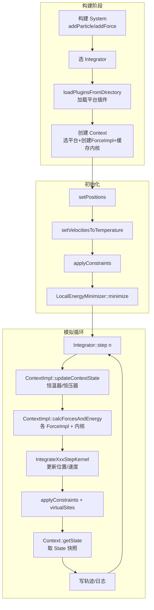
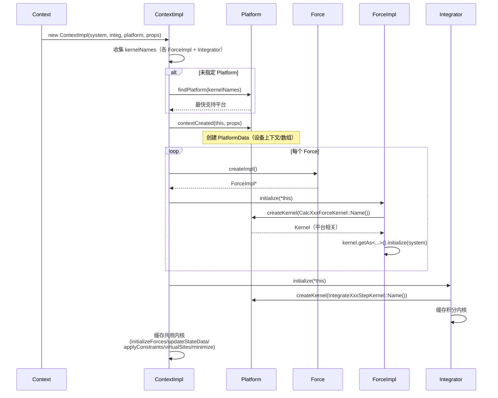
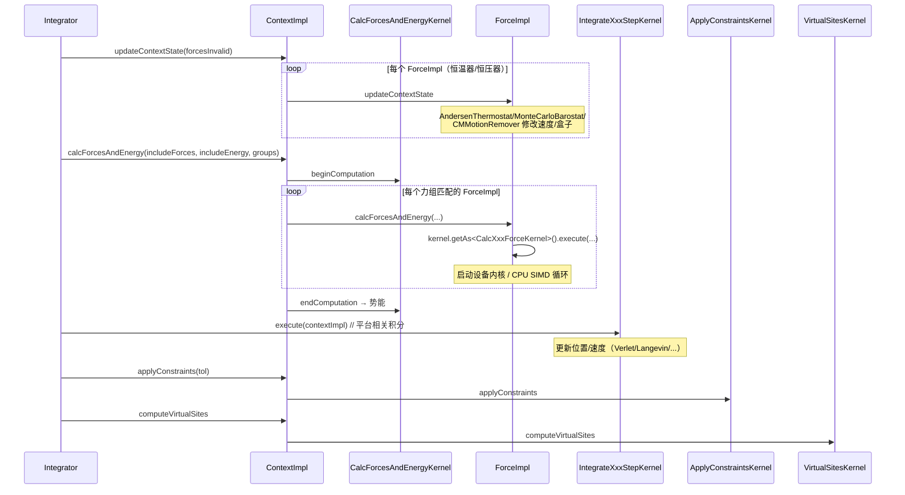
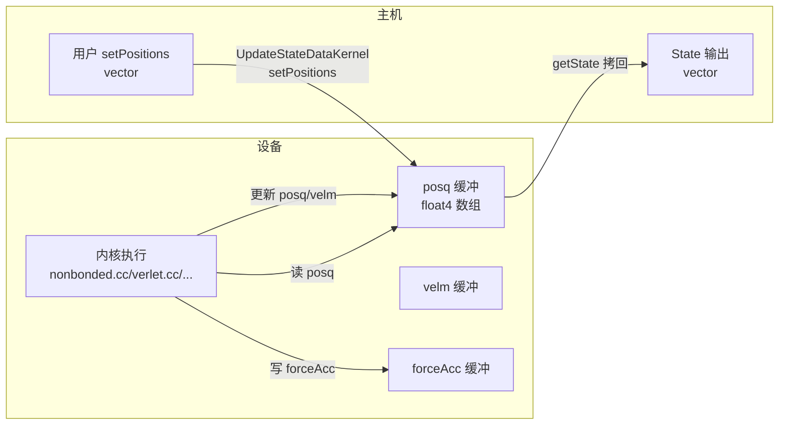

# 10 · 端到端模拟工作流

本篇从运行时视角追踪一次完整的 OpenMM 模拟，标注关键代码路径（`file:line`），帮助理解"一行 `integ.step(1000)` 背后发生了什么"。

## 10.1 工作流总览



## 10.2 阶段一：构建与 Context 创建

### 10.2.1 构建 System

```cpp
System system;
system.addParticle(mass);                    // openmmapi/include/openmm/System.h
system.setDefaultPeriodicBoxVectors(a,b,c);
NonbondedForce* nb = new NonbondedForce();
nb->addParticle(charge, sigma, epsilon);
system.addForce(nb);                         // 接管所有权
system.addForce(new MonteCarloBarostat(1.0, 300));
```

`System` 只存数据，不做计算。

### 10.2.2 加载插件

```cpp
Platform::loadPluginsFromDirectory(Platform::getDefaultPluginsDirectory());
```
- `olla/src/Platform.cpp::loadPluginsFromDirectory`
- `dlopen` 每个 `.so`，两阶段调 `registerPlatforms()` + `registerKernelFactories()`
- Python 端 `openmm/__init__.py` 启动时自动调用

### 10.2.3 创建 Context（核心）

```cpp
LangevinMiddleIntegrator integ(300, 1.0, 0.002);
Context context(system, integ);   // 或带 Platform/properties
```

`Context` 构造 → `ContextImpl` 构造（`openmmapi/src/ContextImpl.cpp`）：



关键代码位置：
- `Context` 构造：`openmmapi/src/Context.cpp`
- `ContextImpl` 构造 + 平台选择：`openmmapi/src/ContextImpl.cpp` 构造函数（`:113-163` 收集内核名 + 选平台）
- `ContextImpl::initialize`：`ContextImpl.cpp:166-184`（创建共用内核）
- `Platform::findPlatform`：`olla/src/Platform.cpp:183-196`

## 10.3 阶段二：初始化状态

```cpp
context.setPositions(initialPositions);
context.setVelocitiesToTemperature(300, seed);
context.applyConstraints(1e-4);
LocalEnergyMinimizer::minimize(context, 1.0, 1000);
```

- `setPositions` → `ContextImpl` → `UpdateStateDataKernel::setPositions`
- `setVelocitiesToTemperature` → `Integrator::getVelocitiesForTemperature` + 设备 RNG
- `applyConstraints` → `ApplyConstraintsKernel`（SETTLE / SHAKE / RATTLE）
- `LocalEnergyMinimizer::minimize`（`openmmapi/src/LocalEnergyMinimizer.cpp`）→ `ContextImpl::minimize` → `MinimizeKernel`（L-BFGS，约束作软约束）

## 10.4 阶段三：模拟循环（step 内部）

```cpp
for (int i = 0; i < nsteps; i += 100) {
    integ.step(100);
    State s = context.getState(State::Positions | State::Energy, true);
    // 写轨迹
}
```

### 10.4.1 Integrator::step 的内部逻辑

`Integrator::step(n)`（`openmmapi/src/Integrator.cpp`）循环 `n` 次，每次：



关键代码：
- `ContextImpl::calcForcesAndEnergy`：`openmmapi/src/ContextImpl.cpp`
- `ContextImpl::updateContextState`：同文件
- `ContextImpl::applyConstraints`：同文件
- 积分内核：各平台的 `IntegrateXxxStepKernel` 实现

### 10.4.2 力组（多时间步）

- `Force::setForceGroup(0..31)` 设组号
- `Integrator::setIntegrationForceGroups(mask)` 决定每步评估哪些组
- `Context::getState(..., groups)` / `calcForcesAndEnergy(..., groups)` 用位掩码过滤
- 典型 MTS：键合/近接触每步评估，非键每 N 步评估（r-RESPA）

`common/` 的 `CommonIntegrateCustomStepKernel` 支持 `computeSum` 指令按组求和。

### 10.4.3 取 State 快照

```cpp
State s = context.getState(State::Positions | State::Forces | State::Energy, true, groups);
```
- `Context::getState`（`openmmapi/src/Context.cpp`）→ `ContextImpl` 构建 `State::StateBuilder`
- 若请求 `Energy` 但力未算，触发一次 `calcForcesAndEnergy`
- 若请求 `KineticEnergy`，调 `Integrator::computeKineticEnergy`
- `enforcePBC=true` 把粒子折回主盒

`State` 不可变，由 `StateBuilder`（友元）填充。

## 10.5 阶段四：参数热更新与重初始化

### 10.5.1 不重建 Context 改参数

```cpp
nb->setParticleParameters(i, q, sigma, eps);
nb->updateParametersInContext(context);
```
- `Force::updateParametersInContext` → `Force::getImplInContext` → `ForceImpl` 更新设备缓冲
- 不需 `reinitialize`，但若拓扑（粒子数/键数/排除）变化则需 `reinitialize`

### 10.5.2 重建 Context

```cpp
context.reinitialize(preserveState=true);
```
- 销毁旧 `ContextImpl`，按当前 `System`/`Integrator` 重建
- `preserveState=true`：保留位置/速度/时间

### 10.5.3 检查点

```cpp
context.createCheckpoint(ostream);   // 二进制，含所有状态
context.loadCheckpoint(istream);
```
用于精确恢复（含 RNG 状态）。

## 10.6 设备数据流（GPU/NPU 视角）

以 CUDA 平台为例，数据流：



NPU 平台同理：`NpuContext` 维护设备缓冲，`NpuUpdateStateDataKernel` 负责主机↔设备拷贝，`CommonXxxKernel`（用 `NpuContext`）编排设备内核执行。

## 10.7 关键代码路径速查

| 操作 | 入口 | 实现 |
|------|------|------|
| 创建 Context | `Context` 构造 | `openmmapi/src/ContextImpl.cpp` 构造 |
| 选平台 | `Platform::findPlatform` | `olla/src/Platform.cpp:183-196` |
| 创建内核 | `Platform::createKernel` | `olla/src/Platform.cpp:143-147` |
| 创建 ForceImpl | `Force::createImpl` | 各 `*Force.cpp` |
| ForceImpl 初始化 | `ForceImpl::initialize` | `openmmapi/src/*Impl.cpp` |
| 求力/能 | `ContextImpl::calcForcesAndEnergy` | `openmmapi/src/ContextImpl.cpp` |
| 恒温/恒压 | `ContextImpl::updateContextState` | 同上 |
| 约束 | `ContextImpl::applyConstraints` | 同上 |
| 虚拟位点 | `ContextImpl::computeVirtualSites` | 同上 |
| 积分一步 | `Integrator::step` | 各平台 `IntegrateXxxStepKernel` |
| 最小化 | `LocalEnergyMinimizer::minimize` | `MinimizeKernel` |
| 取状态 | `Context::getState` | `openmmapi/src/Context.cpp` |
| 加载插件 | `Platform::loadPluginsFromDirectory` | `olla/src/Platform.cpp` |

## 10.8 NPU 适配者的工作流关注点

1. **Context 创建阶段**：`NpuPlatform::contextCreated` 需初始化 `NpuContext`（设备/流/编译器）
2. **力计算阶段**：每个 `CommonCalcXxxForceKernel`（用 `NpuContext`）会调 `compileProgram` 编译设备内核——首次编译慢，靠 csha1 缓存
3. **积分阶段**：`CommonIntegrateXxxStepKernel` 复用，需 `NpuIntegrationUtilities`（约束、RNG）
4. **State 拷贝**：`CommonUpdateStateDataKernel` 负责主机↔设备拷贝，NPU 需实现 `NpuArray` 的拷贝原语
5. **瓶颈通常在**：非键力内核（`NpuCalcNonbondedForceKernel`，需手写优化）+ PME FFT（`NpuFFT3D`）

详见 [11-npu-adaptation-guide.md](11-npu-adaptation-guide.md)。

下一篇 [11-npu-adaptation-guide.md](11-npu-adaptation-guide.md) 是实战路线图。
