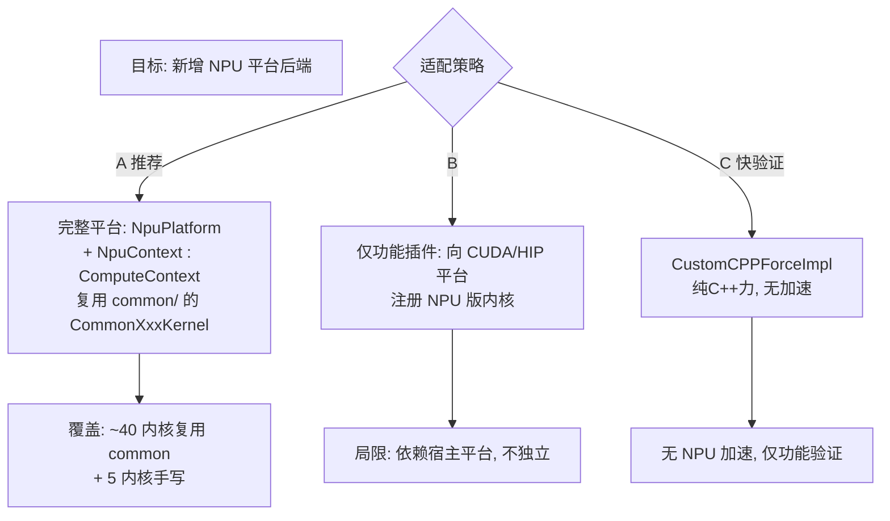

# 11 · NPU 适配实战指南

本篇是面向**为华为昇腾 Ascend/CANN 等 NPU 后端适配 OpenMM 平台**的实战路线图。基于前 10 篇对架构的理解，给出可落地的步骤清单。

> 约定：以 Ascend NPU + CANN 为例，但思路适用于任何 NPU（寒武纪、燧原等）。

## 11.1 适配策略总览



**推荐策略 A**：新增独立 `NpuPlatform`，让 `NpuContext` 继承 `common/` 的 `ComputeContext`，复用 `CommonXxxKernel`。这是 HIP 平台的成熟范式，工作量可控。

## 11.2 工作量估算

| 模块 | 复用 common | 手写 | 工作量 |
|------|------------|------|--------|
| Platform 类 | — | `NpuPlatform` | 小 |
| KernelFactory | — | `NpuKernelFactory`（switch 返回 Common/Npu 内核） | 小 |
| 设备上下文 | 继承 `ComputeContext` | `NpuContext`（核心） | **大** |
| 设备数组 | 继承 `ComputeArray` | `NpuArray` | 中 |
| 程序/内核 | 继承 `ComputeProgram`/`ComputeKernel` | `NpuProgram`/`NpuKernel` | 中 |
| 排序 | — | `NpuSort` | 中 |
| FFT | — | `NpuFFT3D`（关键） | 中 |
| 工具子系统 | 继承抽象 | `NpuBondedUtilities` 等薄壳 | 小 |
| 非键力内核 | — | `NpuCalcNonbondedForceKernel`（手写优化） | **大** |
| 其余力/积分内核 | `CommonXxxKernel` | 设备源码 `.npu`（66 个共享 + ~8 平台原语） | **大** |
| 宏层 | — | `common.npu`（映射 KERNEL/GLOBAL/real 等） | 中 |
| CMake | 镜像 `platforms/hip/CMakeLists.txt` | 检测 CANN | 小 |

## 11.3 目录结构建议

镜像 `platforms/hip/`：

```
platforms/npu/
├── CMakeLists.txt
├── include/
│   ├── NpuPlatform.h
│   ├── NpuKernelFactory.h
│   ├── NpuKernels.h              # NPU 专属内核声明
│   ├── NpuKernel.h               # ComputeKernel 子类
│   ├── NpuContext.h              # ComputeContext 子类（核心）
│   ├── NpuArray.h                # ComputeArray 子类
│   ├── NpuProgram.h              # ComputeProgram 子类
│   ├── NpuBondedUtilities.h
│   ├── NpuNonbondedUtilities.h
│   ├── NpuIntegrationUtilities.h
│   ├── NpuExpressionUtilities.h
│   ├── NpuForceInfo.h
│   ├── NpuFFT3D.h                # FFT3D 子类（关键）
│   ├── NpuSort.h                 # ComputeSort 子类
│   ├── NpuEvent.h
│   ├── NpuQueue.h
│   └── NpuParallelKernels.h      # 多 NPU 并行
├── src/
│   ├── NpuPlatform.cpp           # registerPlatforms + 属性
│   ├── NpuKernelFactory.cpp      # switch 返回 Common/Npu 内核
│   ├── NpuKernels.cpp            # NPU 专属内核实现
│   ├── NpuContext.cpp            # 设备管理 + 编译 + 缓存
│   ├── NpuArray.cpp
│   ├── NpuProgram.cpp
│   ├── NpuBondedUtilities.cpp
│   ├── NpuNonbondedUtilities.cpp
│   ├── NpuIntegrationUtilities.cpp
│   ├── NpuExpressionUtilities.cpp
│   ├── NpuFFT3D.cpp
│   ├── NpuSort.cpp
│   ├── NpuParallelKernels.cpp
│   ├── NpuKernelSources.cpp.in   # EncodeKernelFiles 模板
│   ├── NpuKernelSources.h.in
│   └── kernels/
│       ├── common.npu            # ★ 宏层（映射方言）
│       ├── intrinsics.npu        # NPU 内建函数
│       ├── nonbonded.npu         # 优化对相互作用
│       ├── findInteractingBlocks.npu
│       ├── sort.npu
│       ├── fft.npu
│       ├── utilities.npu
│       ├── vectorOps.npu
│       └── parallel.npu
├── sharedTarget/                 # 共享库 target（插件）
│   └── CMakeLists.txt
├── staticTarget/                 # 静态库 target
│   └── CMakeLists.txt
└── tests/
    ├── NpuTests.h
    └── TestNpu*.cpp
```

## 11.4 实施步骤

### 步骤 1：搭建最小可编译骨架

目标：`NpuPlatform` 能注册，`Context` 能选中（即便用 Reference 内核兜底也行）。

1. 创建 `platforms/npu/include/NpuPlatform.h`：
   ```cpp
   class NpuPlatform : public Platform {
   public:
       NpuPlatform();
       const string& getName() const override { static string n="NPU"; return n; }
       double getSpeed() const override { return 100; }  // > CPU 的 10
       bool supportsDoublePrecision() const override { return false; }  // NPU 通常 float
       void contextCreated(ContextImpl&, const map<string,string>&) override;
       void contextDestroyed(ContextImpl&) override;
       // ...
   };
   ```
2. `NpuPlatform.cpp` 导出 `registerPlatforms()`：
   ```cpp
   extern "C" OPENMM_EXPORT_NPU void registerPlatforms() {
       if (NpuPlatform::isPlatformSupported())  // 检测 CANN 可用
           Platform::registerPlatform(new NpuPlatform());
   }
   ```
3. 构造函数注册一个最小 `NpuKernelFactory`（先全返回 nullptr 或 Reference 兜底）
4. CMake 接入（见 11.5）

验证：`Platform::loadPluginsFromDirectory` 后 `getPlatformByName("NPU")` 能取到。

### 步骤 2：实现 NpuContext（核心）

`NpuContext : public ComputeContext`（`platforms/common/include/openmm/common/ComputeContext.h`）需实现：

| 方法 | 说明 |
|------|------|
| 设备管理 | 选 NPU 设备、创建 stream（CANN `aclrtStream`）、上下文（`aclrtContext`） |
| `compileProgram(source, defines)` | 前置 `common.npu` 宏层 + 平台原语，调 NPU 编译器（Ascend C / CANN `aclCompileKernel`），缓存（用 csha1 哈希源码） |
| `createArray()` | 返回 `NpuArray` |
| `createProgram()` | 返回 `NpuProgram` |
| `createEvent()`/`createQueue()` | 异步原语 |
| `getWorkThread()` | 复用 `ThreadPool`（主机侧） |
| `getBondedUtilities()`/`getNonbondedUtilities()`/`getIntegrationUtilities()`/`ExpressionUtilities` | 实例化 NPU 版工具 |
| `addPostProcessingKernel()` | 粒子重排后处理 |
| `requestNeighborList()` | 返回邻居表 |

参考实现：`platforms/hip/src/HipContext.cpp`（最贴近 NPU 场景）。

### 步骤 3：实现 NpuArray（设备数组）

`NpuArray : public ComputeArray`，封装 CANN 设备内存：
- `aclrtMalloc`/`aclrtFree` 分配释放
- `aclrtMemcpy` 主机↔设备拷贝（`ACL_MEMCPY_HOST_TO_DEVICE` 等）
- 支持 `download`/`upload`/`copyFrom`/`copyTo`

参考：`platforms/hip/src/HipArray.cpp`。

### 步骤 4：实现 NpuProgram / NpuKernel（编译与执行）

- `NpuProgram::createKernel(name)` → `NpuKernel`
- `NpuKernel::addArg(i, value)`/`setArg`/`execute(size)` —— 调 `aclrtLaunchKernel`
- `compileProgram`：把 `common.npu` + 共享 `.cc` 源 + 平台 `.npu` 拼接，调 NPU 编译器

### 步骤 5：编写 common.npu 宏层 ★

`platforms/npu/src/kernels/common.npu` 映射平台无关方言到 NPU 编程模型。参照 `platforms/hip/src/kernels/common.hip` + `intrinsics.hip`：

```c
// 伪代码示例
#define KERNEL extern "C" __global__
#define GLOBAL
#define LOCAL __local__
#define GLOBAL_ID(x) get_global_id(x)
#define GLOBAL_SIZE(x) get_global_size(x)
#define SYNC_WARPS() __syncthreads()
#define RESTRICT __restrict__
typedef float real;
typedef float2 mixed;  // 或 double2 视精度
// make_float4 / math 内建 等
```

> Ascend C 的编程模型与 CUDA/HIP 差异较大（tiling、Cube/Vector 核），可能需要在 `intrinsics.npu` 中做更复杂的映射，甚至重写部分 `.npu` 内核而非纯宏映射。这是工作量最大的部分。

### 步骤 6：移植共享设备内核源

`platforms/common/src/kernels/*.cc`（66 个）用平台无关方言写，理论上宏映射后可直接编译。但 NPU 架构特性（如 tilng）可能要求改写部分内核。建议：
1. 先用宏映射尝试编译全部 66 个 `.cc`
2. 对编译失败或性能差的，在 `platforms/npu/src/kernels/` 写 NPU 专属版本，覆盖共享版本

### 步骤 7：实现工具子系统

- `NpuBondedUtilities`、`NpuNonbondedUtilities`、`NpuIntegrationUtilities`、`NpuExpressionUtilities`：通常薄壳，委托 `NpuContext` 编译/执行内核。参考 `platforms/hip/src/Hip*Utilities.cpp`。
- `NpuExpressionUtilities`：处理 Lepton 表达式 → NPU 源码字符串。复用 `common/ExpressionUtilities` 的逻辑，只替换编译后端。

### 步骤 8：手写关键平台专属内核

`NpuKernelFactory` 对以下内核返回 NPU 专属实现（其余返回 `CommonXxxKernel`）：

| 内核 | 原因 |
|------|------|
| `NpuCalcNonbondedForceKernel` | 非键力是性能关键，需 NPU 优化的对相互作用 + 邻居表 |
| `NpuCalcForcesAndEnergyKernel` | 力/能总调度，多 NPU 时需并行版 |
| `NpuCalcConstantPotentialForceKernel` | 特殊力 |
| `NpuCalcCustomCVForceKernel` | CV 力 |
| `NpuCalcATMForceKernel` | 自由能 |
| `NpuParallelCalcNonbondedForceKernel` | 多 NPU 并行（可选） |

参考 `platforms/hip/src/HipKernels.cpp`。

### 步骤 9：实现 NpuFFT3D（PME 关键）★

`NpuFFT3D : public FFT3D`（`platforms/common/include/openmm/common/FFT3D.h`）。两条路：
1. **用 CANN 的 FFT 接口**（若有）封装
2. **改 vkfft 支持 NPU 后端**（vkfft 已支持多后端）

PME 性能依赖 FFT，务必优化。

### 步骤 10：实现 NpuSort

`NpuSort : public ComputeSort`，基数排序，用于邻居表/粒子重排。参考 `platforms/hip/src/HipSort.cpp`。

### 步骤 11：内核缓存

`NpuContext::compileProgram` 用 `libraries/csha1/` 哈希源码字符串作键，缓存编译产物到磁盘（如 `/tmp/openmm_npu_cache/`）。NPU 编译慢，缓存是性能关键。参考 `platforms/cuda/src/CudaContext.cpp`。

### 步骤 12：CMake 集成

见 11.5 节。

### 步骤 13：测试

`platforms/npu/tests/`：镜像 `platforms/hip/tests/`，用 Reference 对照。先跑最小测试（`TestNpuHarmonicBondForce` 等），逐步扩展。

### 步骤 14：Python 端

无需改 wrapper。用户：
```python
import openmm
openmm.Platform.loadPluginsFromDirectory(openmm.Platform.getDefaultPluginsDirectory())
plat = openmm.Platform.getPlatformByName("NPU")
ctx = openmm.Context(system, integrator, plat)
```

## 11.5 CMake 集成

### 顶层 `CMakeLists.txt` 追加

```cmake
# NPU platform (Ascend/CANN)
find_path(CANN_INCLUDE_DIR acl/acl.h
    HINTS $ENV{ASCEND_HOME}/include $ENV{ASCEND_HOME_PATH}/include
          /usr/local/ascend/acl/include /usr/local/ascend/include)
find_library(CANN_RUNTIME acl
    HINTS $ENV{ASCEND_HOME}/lib64 $ENV{ASCEND_HOME_PATH}/lib64
          /usr/local/ascend/acl/lib64 /usr/local/ascend/lib64)
if(CANN_INCLUDE_DIR AND CANN_RUNTIME)
    set(OPENMM_BUILD_NPU_LIB ON CACHE BOOL "Build OpenMMNPU library for Ascend NPU")
else()
    set(OPENMM_BUILD_NPU_LIB OFF CACHE BOOL "Build OpenMMNPU library for Ascend NPU")
endif()
if(OPENMM_BUILD_NPU_LIB AND (OPENMM_BUILD_CUDA_LIB OR OPENMM_BUILD_OPENCL_LIB OR OPENMM_BUILD_HIP_LIB OR OPENMM_BUILD_COMMON))
    set(OPENMM_BUILD_COMMON ON)
endif()
if(OPENMM_BUILD_NPU_LIB)
    add_subdirectory(platforms/npu)
endif()
```

### `platforms/npu/CMakeLists.txt`（镜像 hip）

```cmake
# 关键片段
set(KERNEL_SOURCE_CLASS NpuKernelSources)
set(KERNEL_SOURCE_DIR ${CMAKE_CURRENT_SOURCE_DIR}/src/kernels)
set(KERNEL_FILE_EXT npu)
include(${OPENMM_DIR}/cmake_modules/EncodeKernelFiles.cmake)
EncodeKernelFiles(...)  # 生成 NpuKernelSources.{cpp,h}

add_library(OpenMMNPU SHARED
    ${NPU_SOURCES}
    ${CMAKE_CURRENT_BINARY_DIR}/NpuKernelSources.cpp
)
target_link_libraries(OpenMMNPU OpenMM OpenMMCommon ${CANN_RUNTIME})
set_target_properties(OpenMMNPU PROPERTIES
    INSTALL_RPATH "${INSTALL_RPATH};$ORIGIN"
)
install(TARGETS OpenMMNPU LIBRARY DESTINATION lib/plugins)
```

## 11.6 关键风险与对策

| 风险 | 对策 |
|------|------|
| NPU 编程模型与 CUDA 差异大（tiling/Cube） | 可能需重写而非宏映射关键内核；先做最小内核（verlet.cc）验证可行性 |
| CANN 编译器不支持某些 Lepton 生成表达式 | 在 `NpuExpressionUtilities` 做表达式规范化/降级 |
| PME FFT 性能 | 优先调通；必要时主机侧 FFT 兜底（用 cpupme 插件模式） |
| 内核编译慢 | csha1 缓存 + 预编译常用内核 |
| 双精度 | NPU 多为 float；设 `supportsDoublePrecision()=false`，用 `mixed` 精度 |
| 测试覆盖 | 用 Reference 全量对照；先键合后非键，先 NVE 后 Langevin |

## 11.7 最小可行验证路径（MVP）

建议按以下顺序逐项打通，每步用 Reference 对照测试：


每步通过后再进下一项，避免一次性面对所有问题。

## 11.8 可复用资产清单

| 资产 | 位置 | 复用方式 |
|------|------|---------|
| `ComputeContext` 抽象 | `platforms/common/include/openmm/common/ComputeContext.h` | 继承 |
| `CommonXxxKernel`（~40 内核） | `platforms/common/src/Common*Kernels.cpp` | `NpuKernelFactory` 返回其实例 |
| 共享设备源码（66 `.cc`） | `platforms/common/src/kernels/*.cc` | 宏映射编译 |
| `EncodeKernelFiles.cmake` | `cmake_modules/` | 嵌入 `.npu` 源 |
| `csha1` | `libraries/csha1/` | 内核缓存键 |
| `hilbert` | `libraries/hilbert/` | 邻居表重排 |
| `lepton` | `libraries/lepton/` | 表达式解析（通过 `ExpressionUtilities`） |
| HIP 平台源码 | `platforms/hip/` | **最佳镜像模板** |
| amoeba 插件结构 | `plugins/amoeba/` | 若做 NPU 专属力场插件 |
| cpupme 模式 | `plugins/cpupme/` | 若做 NPU+CPU 混合 PME |

## 11.9 参考资料

- OpenMM 开发指南（`docs-source/developerguide/`）：含"Writing Plugins"、"OpenCL Platform"、"CUDA Platform"、"Common Compute"章节
- `platforms/hip/` 源码：NPU 最贴近的镜像
- `platforms/common/` 源码：复用核心
- `olla/include/openmm/kernels.h`：必须实现的契约
- CANN 文档：`https://www.hiascend.com/document`
- OpenMM 论坛：`https://github.com/openmm/openmm/discussions`

## 11.10 检查清单

实施前确认：
- [ ] 通读本系列 01–10 篇，理解三层架构与 Kernel 分发
- [ ] 通读 `platforms/hip/` 全部源码，理解 GPU 平台范式
- [ ] 通读 `platforms/common/include/openmm/common/ComputeContext.h` 抽象接口
- [ ] 通读 `olla/include/openmm/kernels.h` 的 45 个内核接口
- [ ] 确认 NPU SDK（CANN）的编程模型、编译器、运行时 API
- [ ] 确认 NPU FFT 方案（CANN FFT 或 vkfft 适配）
- [ ] 搭建 CANN 开发环境，能编译运行简单 NPU 内核

实施中：
- [ ] 按 11.7 的 MVP 路径逐项打通
- [ ] 每项用 Reference 对照测试（`ASSERT_EQUAL_TOL`）
- [ ] 实现内核缓存
- [ ] 处理表达式转译边界情况

实施后：
- [ ] 跑通完整蛋白-配体 MD（如 `examples/python-examples/simulatePdb.py`）
- [ ] 性能基准（对比 CPU/CUDA）
- [ ] 集成进 `md-ifps-adpat_npu` 等上层应用

---

至此 NPU 适配指南完毕。回到 [README.md](README.md) 看其它文档，或看 [architecture-diagrams.md](architecture-diagrams.md) 的可视化图集。
