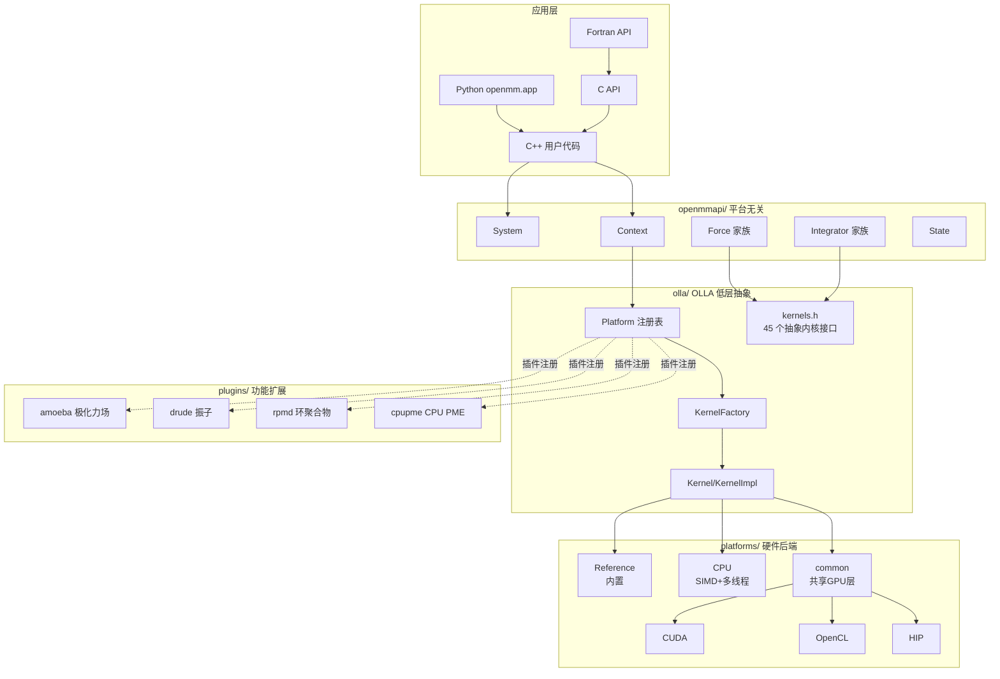

# OpenMM 源码架构文档

本目录是基于 **OpenMM 8.5.0** 源码整理的架构文档，面向**希望为 NPU（如华为昇腾 Ascend/CANN）等新硬件后端做适配**的技术人员。

## 文档导航

| 文档 | 内容 | 重点 |
|------|------|------|
| [01-overview.md](01-overview.md) | OpenMM 是什么、整体架构分层、核心设计理念 | 全局视角 |
| [02-core-api.md](02-core-api.md) | 公共 C++ API 详解：System / Context / Force / Integrator / State | API 表面 |
| [03-platform-kernel.md](03-platform-kernel.md) | Platform / Kernel / KernelFactory 抽象与插件自注册 | **NPU 适配核心** |
| [04-platforms.md](04-platforms.md) | 6 个平台逐一剖析（Reference / CPU / CUDA / OpenCL / HIP / common） | **后端实现范式** |
| [05-plugins.md](05-plugins.md) | amoeba / drude / rpmd / cpupme 插件 | 功能扩展机制 |
| [06-serialization.md](06-serialization.md) | SerializationProxy / XmlSerializer 机制 | 状态持久化 |
| [07-libraries.md](07-libraries.md) | 11 个第三方库用途 | 依赖盘点 |
| [08-wrappers.md](08-wrappers.md) | C / Fortran / Python 语言封装生成机制 | 多语言绑定 |
| [09-build-system.md](09-build-system.md) | CMake 选项、平台自动检测、构建流程 | 编译集成 |
| [10-workflow.md](10-workflow.md) | 端到端模拟工作流与关键代码路径 | 运行时行为 |
| [11-npu-adaptation-guide.md](11-npu-adaptation-guide.md) | **NPU 适配实战指南**：新增平台后端的步骤清单 | **适配路线图** |
| [architecture-diagrams.md](architecture-diagrams.md) | Mermaid 架构图、类关系图、调用时序图 | 可视化 |

## 阅读建议（NPU 适配者）

1. 先读 `01-overview.md` 建立全局观
2. 精读 `03-platform-kernel.md` 理解 Platform/Kernel 分发机制
3. 精读 `04-platforms.md` 中 **common + cuda/hip** 部分（这是 NPU 后端最该模仿的范式）
4. 读 `05-plugins.md` 理解插件如何向已注册平台追加 Kernel
5. 最后按 `11-npu-adaptation-guide.md` 的清单动手

## 源码路径约定

OpenMM 源码仓库：https://github.com/openmm/openmm.git

文档中源码路径均相对于该仓库根目录，例如 `openmmapi/src/ContextImpl.cpp`
对应 https://github.com/openmm/openmm/blob/master/openmmapi/src/ContextImpl.cpp

行号引用格式为 `path:line`（如 `ContextImpl.cpp:113`），便于在源码中定位。

## 版本信息

- OpenMM 版本：8.5.0（`CMakeLists.txt:158-160`）
- C++ 标准：C++11（`CMakeLists.txt:97`）
- CMake 最低版本：3.17
- 整理日期：2026-07-13

## 核心架构速览（Mermaid）

