# 架构图集（Mermaid）

本篇汇总全系列文档用到的 Mermaid 图，便于集中浏览。GitHub、VSCode、Typora 等支持 Mermaid 的工具可直接渲染。

## 1. 三层架构总览

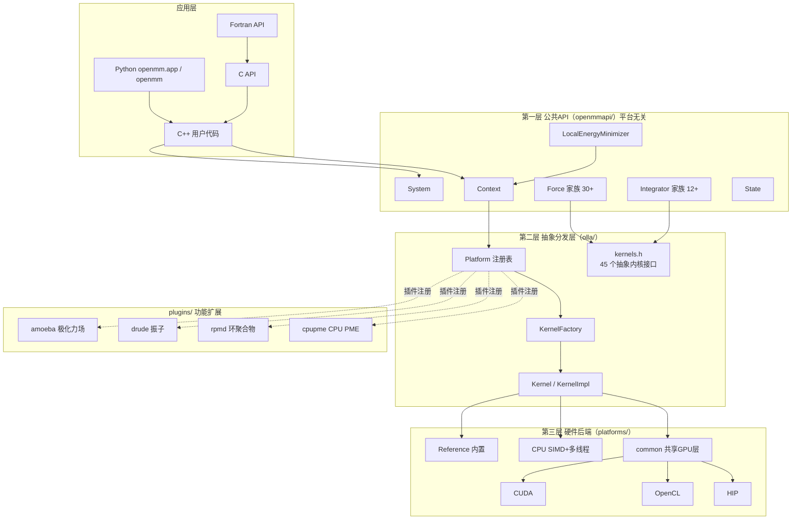

## 2. 类关系图（核心 API）

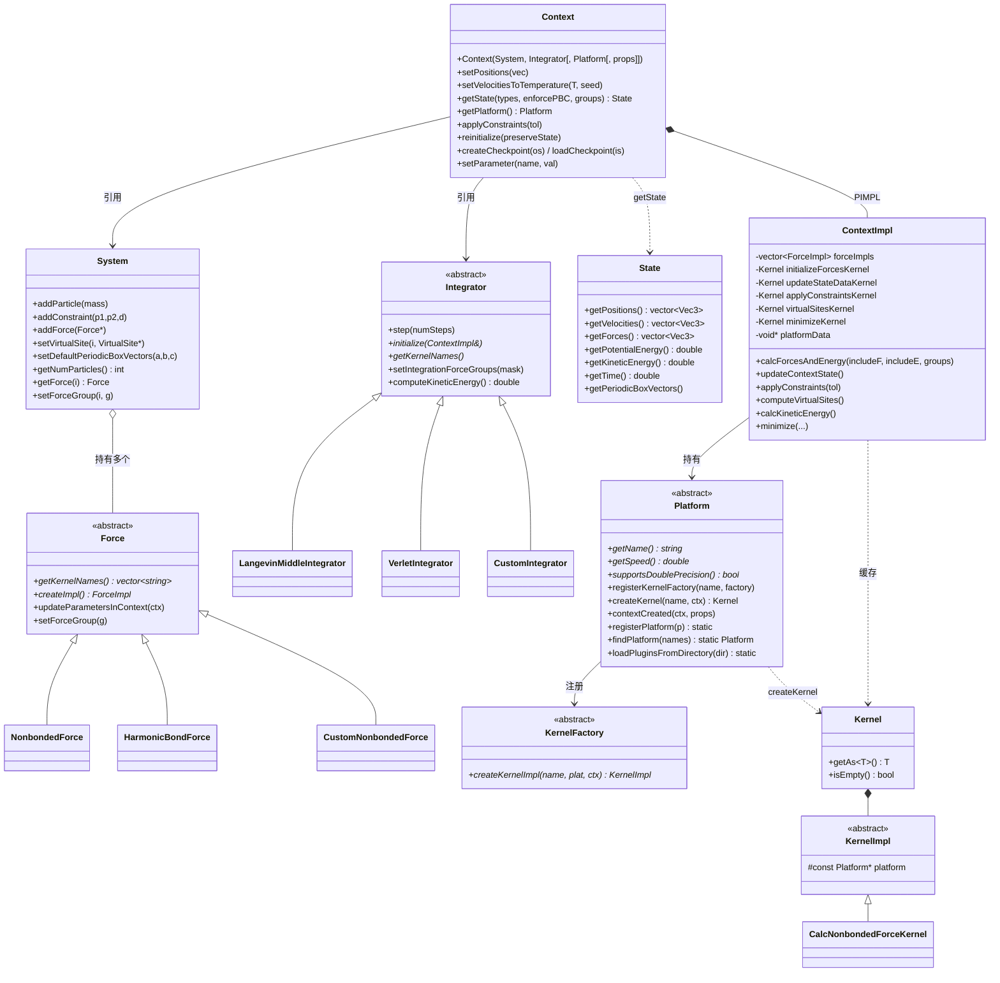

## 3. Platform / Kernel 分发时序

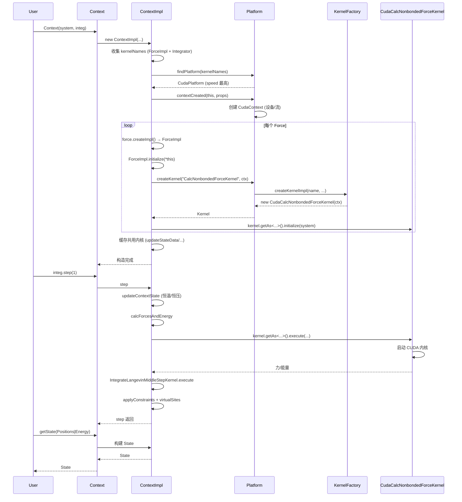

## 4. 平台选择算法

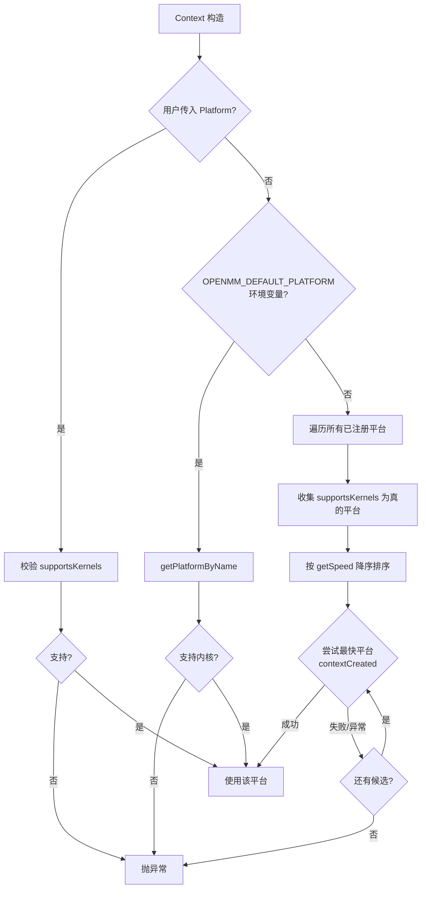

## 5. 插件两阶段加载

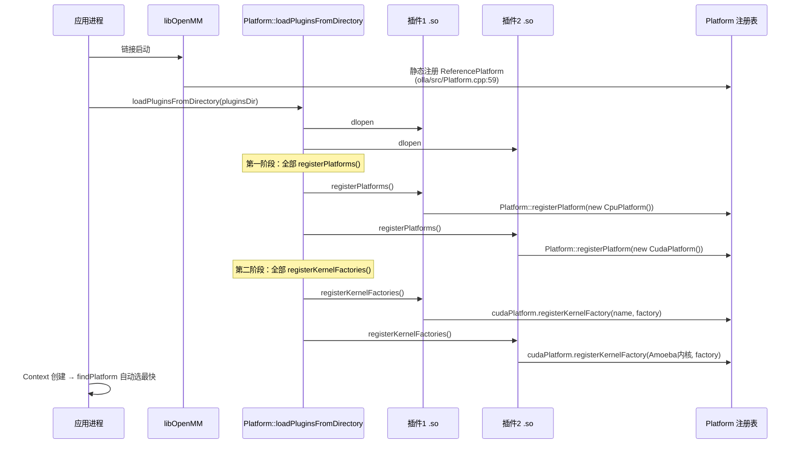

## 6. common 共享 GPU 层架构

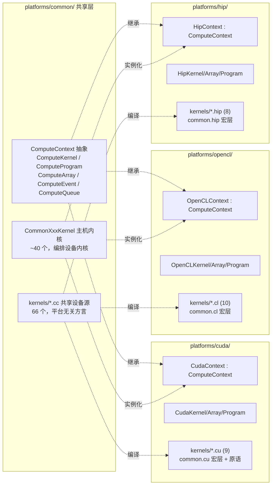

## 7. 设备数据流（GPU/NPU 视角）

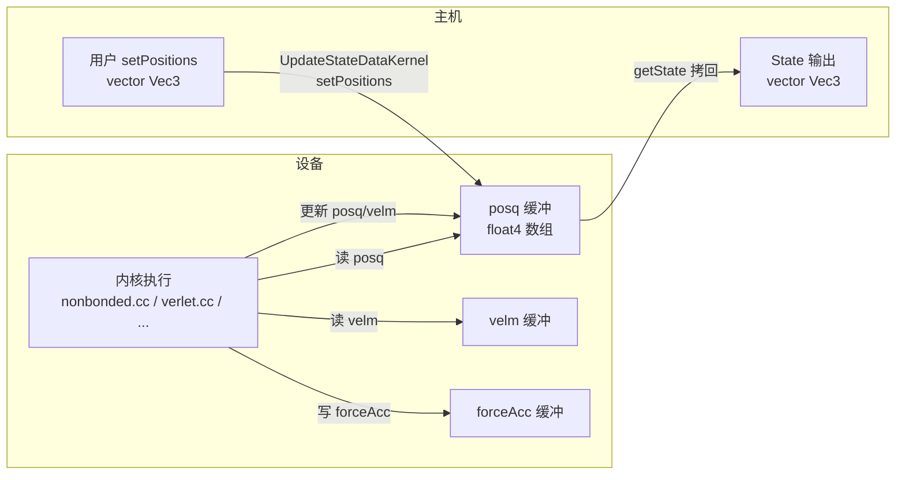

## 8. 模拟循环内部

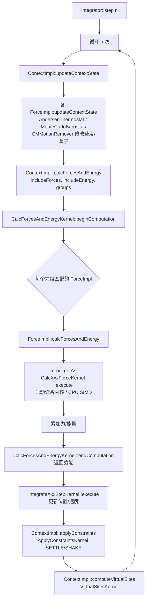

## 9. 语言封装生成流

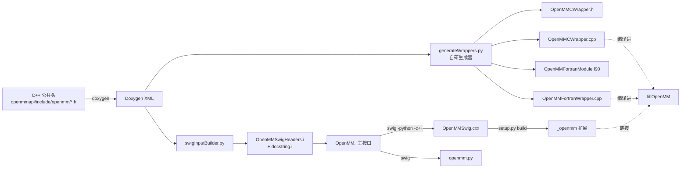

## 10. NPU 平台 MVP 验证路径

```mermaid
flowchart LR
    S1[1. 平台注册<br/>getPlatformByName NPU] --> S2[2. Context 创建<br/>NpuContext 初始化设备]
    S2 --> S3[3. UpdateStateData<br/>setPositions/getState 拷贝]
    S3 --> S4[4. HarmonicBondForce<br/>最简单力]
    S4 --> S5[5. VerletIntegrator<br/>NVE 一步]
    S5 --> S6[6. NonbondedForce 无 cutoff<br/>真空非键]
    S6 --> S7[7. PME 周期边界<br/>NpuFFT3D]
    S7 --> S8[8. LangevinMiddleIntegrator<br/>恒温 RNG]
    S8 --> S9[9. CustomNonbondedForce<br/>Lepton 表达式转译]
    S9 --> S10[10. 约束 SETTLE<br/>水模型]
    S10 --> S11[11. 完整蛋白-配体 MD]
```

## 11. NPU 适配工作量分布

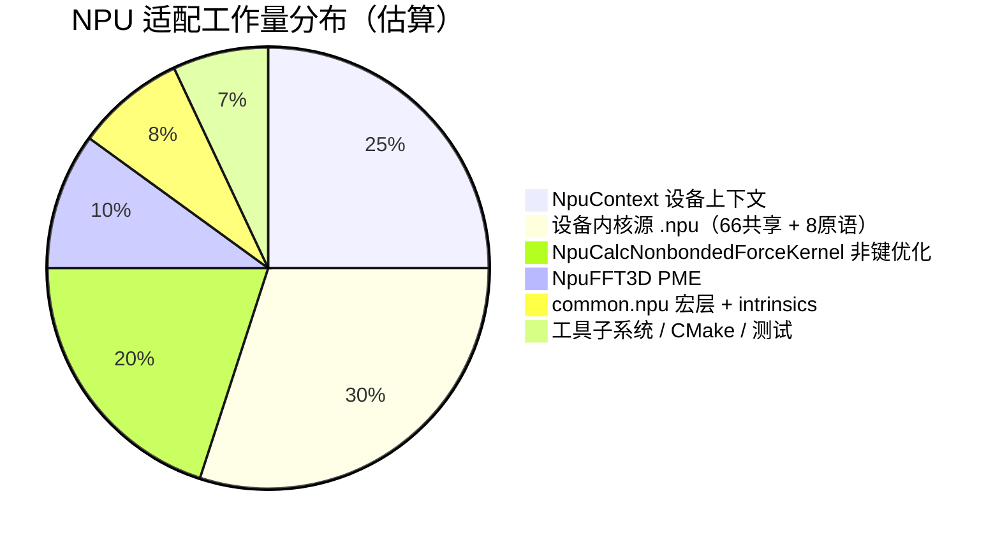

## 12. 第三方库依赖关系

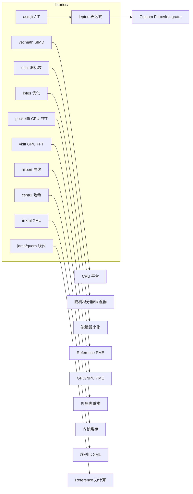

---

更多细节见各专题文档。回到 [README.md](README.md)。
